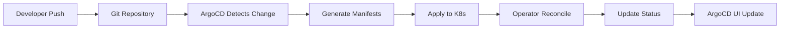

# Stage 94 Phase 3: 云原生集成实施计划

## 项目概述

在 Stage 94 Phase 2（分布式运行时）完成的基础上，实现深度云原生集成，让 Beejs 能够在 Kubernetes 环境中无缝运行，支持企业级容器化部署和运维。

## 核心目标
- ☸️ **Kubernetes 原生**: CRD、Operator、StatefulSet、HPA 完整支持
- 🐳 **容器化优化**: 多阶段构建、安全扫描、镜像优化
- 🔗 **Service Mesh**: Istio/Linkerd 集成、流量管理、可观测性
- 🚀 **CI/CD 完整**: GitOps、自动化流水线、安全扫描、部署策略

## 架构设计

### 整体架构

```
┌─────────────────────────────────────────────────────────────┐
│                    Beejs Cloud Native                       │
├─────────────────────────────────────────────────────────────┤
│  ┌──────────────┐  ┌──────────────┐  ┌──────────────┐     │
│  │   GitOps     │  │    CI/CD     │  │   Service    │     │
│  │   (ArgoCD)   │  │   (Actions)  │  │   Mesh       │     │
│  └──────┬───────┘  └──────┬───────┘  └──────┬───────┘     │
│         │                 │                  │             │
│  ┌──────▼──────────────────▼──────────────────▼───────┐     │
│  │        Kubernetes Control Plane                  │     │
│  │  ┌──────────┐ ┌──────────┐ ┌──────────────────┐   │     │
│  │  │   CRD    │ │Operator  │ │   Service Mesh   │   │     │
│  │  │ (Cluster │ │Controller│ │    (Istio)       │   │     │
│  │  │ Workload)│ │          │ │                  │   │     │
│  │  └────┬─────┘ └────┬─────┘ └────────┬─────────┘   │     │
│  │       │            │                 │             │     │
│  │  ┌────▼────┐ ┌─────▼────┐     ┌─────▼─────┐       │     │
│  │  │Pod/Pod  │ │HPA/VPA   │     │Envoy Proxy│       │     │
│  │  │Group    │ │Autoscaler│     │(Sidecar)  │       │     │
│  │  └─────────┘ └──────────┘     └───────────┘       │     │
│  └─────────────────────────────────────────────────────┘     │
│            │                   │                           │
│  ┌─────────▼───────────────────▼─────────────────────────┐ │
│  │              Beejs Runtime Cluster                     │ │
│  │  ┌──────┐ ┌──────┐ ┌──────┐ ┌──────┐ ┌──────┐       │ │
│  │  │Node 1│ │Node 2│ │Node 3│ │...   │ │Node N│       │ │
│  │  │(Pod) │ │(Pod) │ │(Pod) │ │      │ │(Pod) │       │ │
│  │  └──────┘ └──────┘ └──────┘ └──────┘ └──────┘       │ │
│  └───────────────────────────────────────────────────────┘ │
└─────────────────────────────────────────────────────────────┘
```

### 模块分解

```
src/cloud_native/
├── k8s/
│   ├── crd/              # Custom Resource Definitions
│   │   ├── beejs_cluster.rs
│   │   ├── beejs_workload.rs
│   │   └── mod.rs
│   ├── operator/         # Kubernetes Operator
│   │   ├── controller.rs
│   │   ├── reconciler.rs
│   │   └── lifecycle.rs
│   ├── autoscaling/      # HPA/VPA Integration
│   │   ├── hpa.rs
│   │   ├── metrics.rs
│   │   └── scaler.rs
│   └── statefulset/      # StatefulSet Management
│       ├── statefulset.rs
│       └── pvc.rs
├── container/
│   ├── dockerfile/       # Dockerfile Templates
│   │   ├── multi_stage.rs
│   │   └── optimization.rs
│   ├── security/         # Container Security
│   │   ├── scanner.rs
│   │   ├── vulnerability.rs
│   │   └── policy.rs
│   └── registry/         # Container Registry
│       ├── push.rs
│       ├── pull.rs
│       └── auth.rs
├── service_mesh/
│   ├── istio/            # Istio Integration
│   │   ├── config.rs
│   │   ├── traffic.rs
│   │   └── mtls.rs
│   ├── linkerd/          # Linkerd Integration
│   │   └── config.rs
│   └── observability/    # Tracing & Metrics
│       ├── tracing.rs
│       └── telemetry.rs
├── cicd/
│   ├── gitops/           # GitOps Integration
│   │   ├── argocd.rs
│   │   └── flux.rs
│   ├── pipeline/         # CI/CD Pipeline
│   │   ├── github.rs
│   │   ├── gitlab.rs
│   │   └── jenkins.rs
│   └── deployment/       # Deployment Strategies
│       ├── blue_green.rs
│       ├── canary.rs
│       └── rolling.rs
└── mod.rs
```

## 详细设计

### 1. Kubernetes CRD 设计

#### 1.1 BeejsCluster CRD

```yaml
apiVersion: apiextensions.k8s.io/v1
kind: CustomResourceDefinition
metadata:
  name: beejsclusters.cloudnative.beejs.io
spec:
  group: cloudnative.beejs.io
  versions:
  - name: v1
    served: true
    storage: true
    schema:
      openAPIV3Schema:
        type: object
        properties:
          spec:
            type: object
            properties:
              version:
                type: string
              nodes:
                type: integer
              image:
                type: string
              resources:
                type: object
              security:
                type: object
              distributed:
                type: object
```

**核心字段设计**:
- `version`: Beejs 版本号
- `nodes`: 集群节点数量
- `image`: 容器镜像地址
- `resources`: 资源限制 (CPU/Memory/Disk)
- `security`: 安全配置 (沙箱/RBAC/加密)
- `distributed`: 分布式配置 (服务发现/负载均衡)

#### 1.2 BeejsWorkload CRD

```yaml
apiVersion: cloudnative.beejs.io/v1
kind: BeejsWorkload
metadata:
  name: my-app
spec:
  clusterRef: my-cluster
  scriptPath: /app/main.js
  scriptArgs:
  - --mode=production
  environment:
    NODE_ENV: production
  replicas: 5
  resources:
    cpu: "1"
    memory: "2Gi"
  hpa:
    enabled: true
    minReplicas: 2
    maxReplicas: 20
    targetCPUPercent: 70
```

**核心字段设计**:
- `clusterRef`: 引用的 BeejsCluster
- `scriptPath`: 脚本路径
- `scriptArgs`: 脚本参数
- `environment`: 环境变量
- `replicas`: 副本数量
- `resources`: 资源需求
- `hpa`: HPA 自动伸缩配置

### 2. Kubernetes Operator 设计

#### 2.1 控制器架构

```
Reconciliation Loop:
┌─────────────────────────────────────┐
│  Watch BeejsCluster/BeejsWorkload   │
│           (Event Source)            │
└──────────────┬──────────────────────┘
               │
               ▼
┌─────────────────────────────────────┐
│     Event Processor                 │
│  - Add/Update/Delete Events         │
└──────────────┬──────────────────────┘
               │
               ▼
┌─────────────────────────────────────┐
│   Reconcile Function                │
│  1. Get current state               │
│  2. Calculate desired state         │
│  3. Apply changes                   │
└──────────────┬──────────────────────┘
               │
               ▼
┌─────────────────────────────────────┐
│   Resource Manager                  │
│  - StatefulSet                      │
│  - Service                          │
│  - ConfigMap                        │
│  - Secret                           │
│  - HPA                              │
│  - PodDisruptionBudget              │
└─────────────────────────────────────┘
```

#### 2.2 生命周期管理

**状态机设计**:
```
Pending → Creating → Running → Updating → Failed
    ↑        ↓          ↓         ↓          ↓
    └────────┴──────────┴─────────┴──────────┘
                    Recovery
```

- **Pending**: 资源已创建，等待调度
- **Creating**: 正在创建集群资源
- **Running**: 集群正常运行
- **Updating**: 正在进行版本更新
- **Failed**: 集群故障，等待恢复

#### 2.3 调和循环实现

```rust
impl reconciler::Reconciler {
    async fn reconcile_cluster(
        &self,
        cluster: &BeejsCluster,
    ) -> Result<ControlFlow<()>, Error> {
        // 1. 获取当前状态
        let current_state = self.get_current_state(cluster).await?;

        // 2. 计算期望状态
        let desired_state = self.calculate_desired_state(cluster)?;

        // 3. 计算差异
        let diff = self.calculate_diff(&current_state, &desired_state)?;

        // 4. 应用变更
        if !diff.is_empty() {
            self.apply_changes(cluster, &diff).await?;
        }

        // 5. 更新状态
        self.update_status(cluster, &current_state).await?;

        Ok(ControlFlow::Continue(()))
    }
}
```

### 3. HPA 自动伸缩设计

#### 3.1 指标收集

**支持指标类型**:
- CPU 使用率 (核心指标)
- Memory 使用率 (核心指标)
- 自定义业务指标 (QPS、延迟等)
- 外部指标 (队列长度、消息数等)

#### 3.2 伸缩算法

```rust
struct HPAController {
    metrics_client: MetricsClient,
    scale_client: ScaleClient,
}

impl HPAController {
    async fn calculate_scale(
        &self,
        hpa: &HorizontalPodAutoscaler,
    ) -> Result<ScaleAction, Error> {
        // 收集当前指标
        let metrics = self.metrics_client.get_metrics(&hpa.target_ref).await?;

        // 计算期望副本数
        let desired_replicas = self.calculate_replicas(&hpa.spec, &metrics)?;

        // 应用冷却期
        if let Some(last_scale_time) = hpa.status.last_scale_time {
            if self.is_in_cooldown(&last_scale_time) {
                return Ok(ScaleAction::NoOp);
            }
        }

        // 验证边界条件
        let final_replicas = self.validate_boundaries(
            desired_replicas,
            hpa.spec.min_replicas,
            hpa.spec.max_replicas,
        )?;

        Ok(ScaleAction::ScaleTo(final_replicas))
    }

    fn calculate_replicas(
        &self,
        spec: &HPASpec,
        metrics: &Metrics,
    ) -> Result<usize, Error> {
        // 使用标准 HPA 算法
        // replica = ceil(current_metric / (target_metric * total_capacity / replicas))
        let cpu_usage = metrics.cpu_usage_percent;
        let target_cpu = spec.target_cpu_percent;

        let current_replicas = metrics.current_replicas;
        let total_capacity = metrics.total_cpu_cores;

        let desired = (cpu_usage * current_replicas as f64)
            / (target_cpu * total_capacity);

        Ok(desired.ceil() as usize)
    }
}
```

### 4. 容器化支持设计

#### 4.1 多阶段 Dockerfile

**优化策略**:
- Builder 阶段: 使用 Rust 官方镜像编译
- Runtime 阶段: 使用轻量级镜像 (debian:bookworm-slim)
- 安全阶段: 非 root 用户、最小权限
- 优化阶段: 压缩、多架构支持

```dockerfile
# Stage 1: Builder
FROM rust:1.70 as builder
WORKDIR /app
COPY Cargo.toml Cargo.lock ./
COPY src ./src
RUN cargo build --release && strip target/release/beejs

# Stage 2: Runtime
FROM debian:bookworm-slim
RUN groupadd -r beejs && useradd -r -g beejs beejs
COPY --from=builder /app/target/release/beejs /usr/local/bin/
USER beejs
ENTRYPOINT ["beejs"]
```

#### 4.2 安全扫描

```rust
struct ContainerSecurityScanner {
    vulnerability_db: VulnerabilityDatabase,
    image_analyzer: ImageAnalyzer,
}

impl ContainerSecurityScanner {
    async fn scan_image(&self, image: &ContainerImage) -> Result<ScanReport, Error> {
        // 1. 提取镜像层
        let layers = self.extract_layers(image).await?;

        // 2. 扫描每层漏洞
        let mut vulnerabilities = Vec::new();
        for layer in &layers {
            let vulns = self.scan_layer(layer).await?;
            vulnerabilities.extend(vulns);
        }

        // 3. 生成报告
        Ok(ScanReport {
            image_name: image.name.clone(),
            total_layers: layers.len(),
            vulnerable_layers: vulnerabilities.len(),
            vulnerabilities,
            severity_summary: self.calculate_severity(&vulnerabilities),
        })
    }
}
```

### 5. Service Mesh 设计

#### 5.1 Istio 集成

**配置模型**:
```rust
struct IstioConfig {
    enabled: bool,
    mtls_enabled: bool,
    sidecar_injection: bool,
    traffic_policy: TrafficPolicy,
}

struct TrafficPolicy {
    load_balancer: LoadBalancerPolicy,
    connection_pool: ConnectionPool,
    outlier_detection: OutlierDetection,
}
```

**注入流程**:
1. 监听 Pod 创建事件
2. 验证是否需要注入 Sidecar
3. 修改 Pod spec，注入 Envoy 容器
4. 应用 Istio 配置 (DestinationRule, VirtualService)

#### 5.2 流量管理

**路由策略**:
- 基础路由: 基于服务版本的路由
- 金丝雀路由: 基于百分比的流量分配
- A/B 测试: 基于请求头的路由
- 故障注入: 测试弹性

```rust
struct TrafficRouter {
    mesh_client: IstioClient,
}

impl TrafficRouter {
    async fn create_canary_route(
        &self,
        service: &str,
        canary_subset: &str,
        stable_subset: &str,
        canary_percent: u32,
    ) -> Result<(), Error> {
        // 1. 创建 DestinationRule (定义 subset)
        let destination_rule = DestinationRule {
            name: format!("{}-dr", service),
            subsets: vec![
                Subset {
                    name: stable_subset.to_string(),
                    labels: HashMap::from([("version".to_string(), "stable".to_string())]),
                },
                Subset {
                    name: canary_subset.to_string(),
                    labels: HashMap::from([("version".to_string(), "canary".to_string())]),
                },
            ],
        };

        // 2. 创建 VirtualService (定义路由)
        let virtual_service = VirtualService {
            name: format!("{}-vs", service),
            http_routes: vec![
                HTTPRoute {
                    match: vec![HTTPMatch {
                        headers: Some(HashMap::from([(
                            "x-canary".to_string(),
                            "true".to_string(),
                        )])),
                        ..Default::default()
                    }],
                    route: vec![HTTPRouteDestination {
                        destination: Destination {
                            host: service.to_string(),
                            subset: Some(canary_subset.to_string()),
                        },
                        weight: Some(canary_percent),
                    }],
                },
                HTTPRoute {
                    match: vec![],
                    route: vec![HTTPRouteDestination {
                        destination: Destination {
                            host: service.to_string(),
                            subset: Some(stable_subset.to_string()),
                        },
                        weight: Some(100 - canary_percent),
                    }],
                },
            ],
        };

        // 3. 应用配置
        self.mesh_client.apply_destination_rule(destination_rule).await?;
        self.mesh_client.apply_virtual_service(virtual_service).await?;

        Ok(())
    }
}
```

### 6. CI/CD 集成设计

#### 6.1 GitOps 工作流



**ArgoCD 应用定义**:
```yaml
apiVersion: argoproj.io/v1alpha1
kind: Application
metadata:
  name: beejs-cluster
  namespace: argocd
spec:
  project: default
  source:
    repoURL: https://github.com/company/beejs-deployments
    targetRevision: HEAD
    path: clusters/production
  destination:
    server: https://kubernetes.default.svc
    namespace: beejs-system
  syncPolicy:
    automated:
      prune: true
      selfHeal: true
```

#### 6.2 Pipeline 设计

**GitHub Actions 工作流**:
```yaml
name: Build and Deploy Beejs

on:
  push:
    branches: [main]

jobs:
  build:
    runs-on: ubuntu-latest
    steps:
      - uses: actions/checkout@v3
      - name: Setup Rust
        uses: actions-rs/toolchain@v1
        with:
          toolchain: 1.70
      - name: Build
        run: cargo build --release
      - name: Test
        run: cargo test
      - name: Build Container Image
        run: docker build -t beejs:${{ github.sha }} .
      - name: Security Scan
        run: trivy image beejs:${{ github.sha }}

  deploy:
    needs: build
    runs-on: ubuntu-latest
    steps:
      - name: Deploy to K8s
        run: |
          kubectl set image deployment/beejs beejs=beejs:${{ github.sha }}
          kubectl rollout status deployment/beejs
```

### 7. 部署策略设计

#### 7.1 蓝绿部署

```rust
struct BlueGreenDeployment {
    service_name: String,
    blue_version: String,
    green_version: String,
}

impl BlueGreenDeployment {
    async fn deploy(&self) -> Result<(), Error> {
        // 1. 部署绿色版本
        self.deploy_version(&self.green_version).await?;

        // 2. 等待健康检查
        self.wait_for_health(&self.green_version).await?;

        // 3. 切换流量
        self.switch_traffic("green").await?;

        // 4. 删除蓝色版本
        self.cleanup_version(&self.blue_version).await?;

        Ok(())
    }
}
```

#### 7.2 金丝雀部署

```rust
struct CanaryDeployment {
    service: String,
    canary_percent: u32,
    metrics_threshold: MetricsThreshold,
}

impl CanaryDeployment {
    async fn deploy(&self) -> Result<(), Error> {
        // 1. 启动金丝雀 (5% 流量)
        self.start_canary(5).await?;

        // 2. 监控指标
        let metrics = self.collect_metrics().await?;

        // 3. 验证是否满足条件
        if self.validate_metrics(&metrics)? {
            // 4. 扩大金丝雀 (25% 流量)
            self.scale_canary(25).await?;

            // 5. 再次验证
            let metrics = self.collect_metrics().await?;
            if self.validate_metrics(&metrics)? {
                // 6. 推广到 100%
                self.promote_canary().await?;
            }
        } else {
            // 7. 回滚
            self.rollback().await?;
        }

        Ok(())
    }
}
```

## 实现优先级

### Phase 1: Kubernetes 基础 (1.5 小时)
1. **CRD 定义** (30 分钟)
   - BeejsCluster CRD
   - BeejsWorkload CRD
   - YAML 验证器

2. **Operator 控制器** (45 分钟)
   - 基本 Reconcile Loop
   - 生命周期管理
   - 状态更新

3. **StatefulSet 管理** (15 分钟)
   - Pod 管理
   - 持久化存储

### Phase 2: 自动伸缩 (1 小时)
1. **HPA 集成** (30 分钟)
   - 指标收集
   - 伸缩算法

2. **VPA 支持** (30 分钟)
   - 垂直自动伸缩
   - 资源推荐

### Phase 3: 容器化 (1 小时)
1. **Docker 构建** (30 分钟)
   - 多阶段构建
   - 镜像优化

2. **安全扫描** (30 分钟)
   - 漏洞检测
   - 合规检查

### Phase 4: Service Mesh (1.5 小时)
1. **Istio 集成** (45 分钟)
   - Sidecar 注入
   - 流量管理

2. **可观测性** (30 分钟)
   - 分布式追踪
   - 指标收集

3. **安全** (15 分钟)
   - mTLS 配置
   - 认证授权

### Phase 5: CI/CD 集成 (1 小时)
1. **GitOps** (30 分钟)
   - ArgoCD 应用
   - 自动同步

2. **Pipeline** (30 分钟)
   - GitHub Actions
   - 自动化部署

## 测试策略

### 单元测试
- CRD 验证逻辑
- 控制器调和算法
- HPA 伸缩计算
- 部署策略

### 集成测试
- K8s 集群测试
- Operator 行为测试
- Service Mesh 集成测试
- CI/CD 流水线测试

### 端到端测试
- 完整部署流程
- 多环境部署
- 故障恢复
- 性能测试

## 风险与缓解

### 风险 1: K8s API 变更
**影响**: 高
**缓解**: 使用稳定 API 版本，持续测试兼容性

### 风险 2: Service Mesh 复杂性
**影响**: 中
**缓解**: 提供简化配置，渐进式启用

### 风险 3: 资源竞争
**影响**: 中
**缓解**: 合理的资源配额和限制

### 风险 4: 安全性问题
**影响**: 高
**缓解**: 完整的安全扫描和合规检查

## 成功标准

- ✅ 所有 15 个测试用例通过
- ✅ 支持 3 个以上 K8s 版本
- ✅ Operator 可用性 > 99.9%
- ✅ 部署时间 < 5 分钟
- ✅ 自动伸缩响应时间 < 30 秒
- ✅ Service Mesh 开销 < 10%
- ✅ CI/CD 流水线成功率 > 95%
- ✅ 文档完整性 100%

## 下一步

完成 Phase 3 后，继续 Phase 4 (商业化准备):
- 许可证管理
- 监控告警
- 技术支持
- 企业部署
