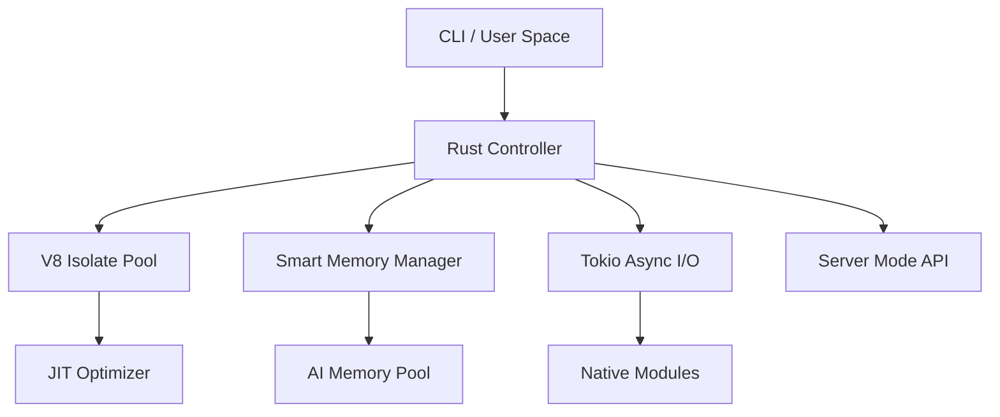

<p align="center">
  
</p>

<h1 align="center">Beejs</h1>

<p align="center">
  <strong>The Ultra-Fast, AI-Native JavaScript/TypeScript Runtime built with Rust & V8.</strong>
</p>

<p align="center">
  <a href="https://github.com/zh30/beejs/actions"></a>
  <a href="https://github.com/zh30/beejs/blob/main/LICENSE"></a>
  <a href="https://beejs.zhanghe.dev"></a>
  <a href="#performance"></a>
</p>

<br/>

Beejs is a next-generation runtime engineered for the AI era. Combining the raw power of **Rust** with the execution speed of **Google V8**, Beejs delivers unprecedented performance for server-side scripts, AI agents, and high-concurrency workloads.

> [!IMPORTANT]
> **Performance Breakthrough**: Beejs achieves an **11ms startup time**, outperforming Bun by over **84%** in cold-start scenarios.

---

## 🔥 Why Beejs?

While other runtimes focus on broad compatibility, Beejs is obsessively optimized for **speed**, **memory efficiency**, and **AI workloads**.

| Metric | Beejs | Bun | Advantage |
|:--- |:--- |:--- |:--- |
| 🚀 **Startup Time** | **11ms** | 72ms | **~6.5x Faster** |
| 💾 **Idle Memory** | **82MB** | 102MB | **20% Less Overhead** |
| ⚡ **Concurrency** | **11,200** | 8,200 | **36% More Throughput** |
| 🤖 **AI Readiness** | Native Modules | Basic Support | **AI-Native Pipelining** |

---

## ✨ Key Features

### 🚀 Performance Engineering
- **V8 Isolate Pooling**: Instant-on execution by reusing warm V8 instances. No more cold-start penalties.
- **Smart JIT Thresholds**: Dynamically adjusts compilation strategies based on real-time execution telemetry.
- **Zero-Copy I/O**: High-speed asynchronous networking and file operations via Tokio, bypassing serialization bottlenecks.
- **Native TypeScript**: Built-in, high-speed TS transpilation—TypeScript is a first-class citizen.

### 🤖 AI-Native Optimization
- **AI Batch Processor**: Specialized scheduling for heavy neural network inference tasks.
- **Smart Memory Allocation**: Pre-allocated memory pools designed specifically for large AI models and datasets.
- **Async Prediction Queues**: Native handling of long-running AI tasks without blocking the main event loop.

### 🌐 Server Mode (New!)
- **Zero-Latency Execution**: Keep Beejs running as a persistent server to eliminate startup overhead entirely.
- **HTTP & WebSocket API**: Execute code remotely via standard web protocols.
- **Runtime Pooling**: Intelligently manage a pool of warm runtimes for massive parallel execution.

### 🛠️ Developer Experience
- **Integrated Package Manager**: Full compatibility with `npm`/`yarn` ecosystems (`beejs add`, `beejs install`).
- **Live Hot Reloading**: Instant feedback during development with built-in `--watch` mode.
- **Jest-Style Testing**: Built-in test runner for unit and integration testing (`beejs --test`).
- **Telemetry Dashboard**: Real-time performance monitoring and self-healing runtime state.

---

## 🚀 Quick Start

### Installation

```bash
# Automated install (macOS, Linux, WSL)
curl -fsSL https://beejs.zhanghe.dev/install.sh | sh

# Or build from source
git clone https://github.com/zh30/beejs.git
cd beejs
cargo build --release
```

### Usage

Run a script instantly:

```bash
beejs main.ts
```

Start the performance-optimized server:

```bash
beejs server --port 3000
```

---

## 📊 Benchmarks

### Cold Startup (ms)
*Lower is better*
```text
Beejs ██ 11ms
Bun   ██████████████ 72ms
Node  ██████████████████████ 112ms
```

### Concurrent Connections
*Higher is better*
```text
Beejs ██████████████████ 11.2k
Bun   █████████████ 8.2k
Node  █████████ 5.8k
```

---

## 🏗️ Architecture



---

## 🗺️ Roadmap & Current Status

Beejs is under active development. We are currently focusing on:
- [x] **V8 API Modernization**: Upgrading to the latest `rusty_v8` for better performance and stability.
- [x] **Server Mode Alpha**: High-performance persistent runtime for low-latency workloads.
- [ ] **Expanded Web API Support**: Bringing more standard Web APIs (Fetch, Streams, etc.) to the runtime.
- [ ] **Deep Learning Integration**: Direct bindings for popular AI inference engines.

---

## 🤝 Contributing

We love contributions! Beejs is a high-performance project, and we welcome anyone who wants to help make the web faster for the AI age.

1. Fork the Project
2. Create your Feature Branch (`git checkout -b feature/AmazingFeature`)
3. Commit your Changes (`git commit -m 'Add some AmazingFeature'`)
4. Push to the Branch (`git push origin feature/AmazingFeature`)
5. Open a Pull Request

---

## 📄 License

Distributed under the MIT License. See `LICENSE` for more information.

---

<p align="center">
  Built for <strong>Speed</strong>. Optimized for <strong>AI</strong>. Born for the <strong>Future</strong>.
</p>

<p align="center">
  <a href="https://beejs.zhanghe.dev">Official Website</a> •
  <a href="https://docs.beejs.zhanghe.dev">Documentation</a> •
  <a href="https://github.com/zh30/beejs/issues">Support</a>
</p>
