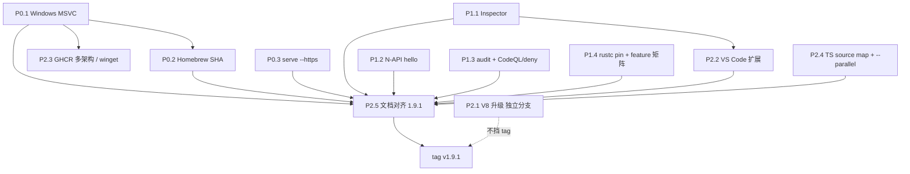

# Beejs v1.9.1 开发计划：基础建设第二波

> **版本**：`1.9.1`（patch）  
> **类型**：基础设施收口，不是新功能大版本  
> **事实来源**：`Cargo.toml`（当前 `1.9.0`）、`src/lib.rs`、`src/main.rs`、`.github/workflows/`、`docs/CURRENT_SCOPE.md`、`docs/INFRASTRUCTURE_CAPABILITY_BACKLOG.md`  
> **不引用**：历史 `STAGE_*` / `IMPLEMENTATION_PLAN_STAGE_*` 作为能力证明  
> **状态**：计划。未实现前不得把本文中的目标写成当前产品事实。

v1.9.0 把语言运行时配套设施的第一波骨架写进了仓库（Release 矩阵、install 脚本、Homebrew formula、GHCR workflow、WinterTC 基线、Dependabot）。第二波要解决的是：**骨架能跑、产物能装、命令不撒谎、调试/原生扩展/门禁达到可验收合同**。

本文是上一轮盘点里 P0–P2 的可执行计划。完成标准见文末「发布门禁」。

---

## 1. 目标与非目标

### 1.1 目标

打 `v1.9.1` tag 时，同时满足：

1. GitHub Release **实际附带** `bee-v1.9.1-x86_64-pc-windows-msvc.zip`（内含 `bee.exe`），且 Windows job **不再** `continue-on-error`。
2. `Formula/bee.rb` 的 SHA256 **不是**占位 `0000…`，`brew` 校验能过。
3. `bee serve --https` **不再**打印提示后 `return Ok(())`。
4. `--inspect` / `--inspect-brk` 至少能：发现协议、在 isolate 上 evaluate、在用户脚本开始前停住。
5. `process.dlopen` 能加载并**调用**一个最小 N-API hello addon（范围明确：不承诺 Prisma/sharp）。
6. `cargo-audit` 失败即红；补 CodeQL 或 `cargo deny`。
7. `rust-toolchain.toml` 钉死具体 rustc；Cargo feature 矩阵只包含**当前能编过**的 feature。
8. TypeScript 报错栈能回到 `.ts` 行号；`bee test --parallel` 语义诚实。
9. VS Code 扩展 README / 调试配置与当前 `bee` 二进制和 Release 资产名一致。
10. 对外文档版本号全部是 `1.9.1`，且与 `Cargo.toml` 一致。

### 1.2 非目标（本版本不做）

- 重开 `src/lib.rs` 里注释掉的历史模块（`aiops`、`ai_inference`、旧 `observability` / `monitor`）。
- 完整 Node 官方测试套、完整 WPT。
- 把 `feature = "ai"` 宣传成产品级 LLM。
- 完整 N-API（async, threadsafe functions, napi 8+ 全表面）。
- Chrome DevTools 级别的完整 CDP（watch、conditional breakpoint、blackboxing）。
- `cluster` / `dgram` / 真实 `http2` / 真实 `tls.connect`。
- crates.io 在未配置 `CARGO_REGISTRY_TOKEN` 时强行发布。
- 为了演示提前打 tag。

### 1.3 版本政策

`1.9.1` 是 **patch**：修发布闭环、修撒谎的 CLI、把已有命令接到真实实现。允许新增 **Experimental** 能力（最小 N-API、HTTPS serve），不允许把 Preview/Experimental 提升为 Stable，除非该项已有集成测试且 `CURRENT_SCOPE.md` 同步改写。

**V8 升级（P2.1）不挡 tag。** 若 `upgrade/rusty-v8-0.32` 在 tag 前不能绿，1.9.1 仍发，升级滑到 `1.10.0`。理由见 [Key Decisions](#10-key-decisions)。

---

## 2. 现状基线（相对 v1.9.0）

| 项 | v1.9.0 事实 | 1.9.1 要变成 |
|---|---|---|
| Windows Release | matrix 有 `x86_64-pc-windows-msvc`，但 `continue-on-error: true`，注释写明 MSVC 仍失败 | job 失败即红，zip 必须出现在 Release |
| Homebrew | `Formula/bee.rb` 指向正确 URL，SHA256 全 0 | 发布 job 回写真实 SHA256 |
| `bee serve --https` | 打印 “requires TLS terminator” 后成功退出 | 有 cert/key 则 rustls 监听；否则非 0 退出 |
| Inspector | 自建 CDP；`Debugger.paused` 的 `callFrames` 为空；不碰 isolate | 至少 evaluate + inspect-brk 真停用户脚本 |
| N-API | `dlopen` 检查符号后直接 `undefined`，不调用注册函数 | 调用 `napi_register_module_v1`，hello fixture 通过 |
| `cargo-audit` | `continue-on-error: true` | 高危失败即红 |
| Feature 矩阵 | 只 check `ai` / `benchmarks` / `observability`；`ai = []` 且历史 AI 树未编 | 矩阵 = 能编过的 feature；编不过的从文档拿掉 |
| rustc | `rust-toolchain.toml` `channel = "stable"` | 钉具体版本 |
| `--parallel` | CLI 警告后串行跑，退出码 0 | 传了就非 0 退出 |
| TS source map | oxc 已生成；`ScriptOrigin` 传入 `undefined` | 栈回到 `.ts` |
| VS Code 扩展 | publisher `beejs-team`，安装 URL 仍是 v0.1.0 `bee-linux-x64` | 对齐 `zh30/beejs` 与当前 asset 名 |
| 文档 | README badge 仍写 v1.0.0；CLI 指南标题 v0.1；`GITHUB_ACTIONS_RUNTIME_INFRASTRUCTURE.md` 过期 | 全部对齐 1.9.1 |
| V8 | `rusty_v8 = "0.22"` | 1.9.1 默认仍 0.22；升级独立分支 |

已知 Windows 编译地雷（P0.1 开工点，不排除还有）：

- `src/runtime_minimal.rs` 约 L22485：无 `cfg` 的 `libc::isatty`（Windows `libc` 没有这个符号）。
- `src/runtime_minimal.rs` `get_rss_memory` 的 Windows 分支：`GetCurrentProcess` 从 `Win32::System::SystemServices` 取，实际应在 `Win32::Foundation`；`windows-sys` feature 也可能不够。
- `src/nodejs_core/fs.rs` 快路径返回 `*const libc::c_char`，Unix `open/read/write` 已 `cfg(unix)`，Windows 必须走 `std::fs` 且能编过类型。
- OpenSSL：已有 `scripts/windows_openssl_env.ps1` 和 choco 安装步骤，P0.1 要验证而不是重写。

---

## 3. 战役怎么切

同一优先级内可并行。跨优先级有依赖：没有 Windows 产物就不要填 brew Windows、也不要宣称 winget。



建议 PR 粒度见 [第 9 节](#9-pr-plan)。不要把 Windows、HTTPS、Inspector、N-API 塞进同一个 PR。

---

## 4. P0 — 必须进 tag，先做

### P0.1 修通 Windows MSVC，去掉 `continue-on-error`

**缺口**：`.github/workflows/release-assets.yml` L26–27：

```yaml
# Windows MSVC still fails on windows-sys/libc/sys-info; do not block Unix archives.
continue-on-error: ${{ matrix.os == 'windows-latest' }}
```

CI 的 `windows-smoke` 只跑 `bee --version` / `eval "1+1"`，不能证明 Release 交叉编译成功。

**要做**

1. **先复现，再改。** 在 `windows-latest` 或本机 `rustup target add x86_64-pc-windows-msvc` 后：
   ```bash
   cargo build --release --target x86_64-pc-windows-msvc
   ```
   把 rustc 报错清单贴进 PR 描述。不要凭猜测大面积 `cfg`。
2. Unix-only `libc` 全部 `#[cfg(unix)]` / `#[cfg(target_family = "unix")]`。Windows 用 `std` 或已有 `windows-sys`。优先修默认构建路径：`src/runtime_minimal.rs`、`src/nodejs_core/fs.rs`、`src/nodejs_core/process.rs`、`src/nodejs_core/tty.rs`、`src/nodejs_core/os.rs`。
3. `sys-info`：若 Windows 链接失败，给 `os.release` / `loadavg` / `mem_info` 加 Windows 回退（`os.rs` 已有部分 `unwrap_or`），或换成 `std` / `windows-sys`，不要为了编过引入新的重型 crate。
4. `windows-sys` feature 按实际 API 补齐（`Win32_Foundation`、`Win32_System_Threading`、`Win32_System_ProcessStatus` 等），修正 `GetCurrentProcess` 的模块路径。
5. OpenSSL：保留 choco + `scripts/windows_openssl_env.ps1`；若仍失败，评估默认构建能否只依赖 rustls（**本版本不承诺去掉 openssl**，只在它挡住 `bee.exe` 时处理）。
6. Release job：删除 Windows 的 `continue-on-error`。`publish-release` 继续要求至少一份 Unix archive，**并且**要求 Windows zip 存在。
7. CI `windows-smoke`：在现有 `--version` / `eval` 之外加 `cargo build --release`（已有）保持；不要把完整 `cargo test` 放上 Windows，磁盘和 V8 编译时间不够。
8. `tests/release_workflow_tests.rs`：断言 **不存在** `continue-on-error` 绑在 `windows-latest` 上。

**验收**

- [ ] `cargo build --release --target x86_64-pc-windows-msvc` 在 CI Windows job 退出码 0。
- [ ] 产物是 `bee-v1.9.1-x86_64-pc-windows-msvc.zip`，内含 `bee.exe`。
- [ ] `release-assets.yml` 无 Windows `continue-on-error`。
- [ ] `.\bee.exe --version` 与 `.\bee.exe eval "1 + 1"` 通过。
- [ ] `install.ps1` 能拼出上述 asset URL（脚本已存在，P0.1 只保证资产真的在）。

**风险**：rusty_v8 0.22 的 Windows 预编译库或 gn 构建失败。若是 V8 本身而不是我们的 `libc` 调用，停下来记入 PR，不要用 stub 假装 Windows 支持；这种情况下 1.9.1 **不能**宣称 Windows 预编译，必须把 CURRENT_SCOPE 改回「Windows 从源码构建 / 未提供预编译」，并保持 `continue-on-error`——同时 **不能**把 P0.1 标完成。优先假设是我们的 Unix libc 泄漏。

---

### P0.2 Homebrew SHA256 自动化

**缺口**：`Formula/bee.rb` 四个平台 `sha256` 都是 64 个 `0`。`brew install` 会 checksum mismatch。formula 本身 URL 已经指向 GitHub Release，不需要改命名规则。

**要做**

1. 新增 `scripts/update_homebrew_formula.py`（或扩展 `scripts/generate_release_notes.py`）：
   - 输入：`release/` 目录里的 `bee-vX-*.tar.gz` 与 tag/version。
   - 输出：改写 `Formula/bee.rb` 的 `version` 与各 `sha256`。
   - 拒绝写入全 0；文件缺失则非 0 退出。
2. `release-assets.yml` 的 `publish-release` job：在 checksums 生成之后、`action-gh-release` 之前跑该脚本，把更新后的 `Formula/bee.rb` **提交回默认分支**（`contents: write` 已有）。若不想 release job 直接 push `main`：改为打开 PR `chore: bump Formula/bee.rb for <tag>`，**tag 说明里必须写清**「Homebrew 要等这条 PR 合并」。推荐直接 push 到 `main` 上的 formula-only commit，减少人工漏。
3. Tap 同步：README 写的是 `brew install zh30/tap/bee`。本仓库 `Formula/bee.rb` 是源；`zh30/homebrew-tap` 若是独立仓库，release 文档加一步 copy。1.9.1 至少保证 **本仓库 formula 哈希正确**。
4. 测试：
   - `tests/release_workflow_tests.rs` 的 `homebrew_formula_points_at_github_release_assets` 增加：公式里不得出现 64 个连续 `0` 作为 sha256（**开发期**可用 fixture 哈希；合并前用一次真实 `shasum` 填进 formula，或让测试只在「脚本把占位符替换」这条路径上用临时文件，避免 CI 在无 release 产物时失败）。
   - 更稳妥：单元测试脚本「给定四个假 tar.gz → 写出的 rb 含对应 sha256」，**不**让 CI 断言当前 `Formula/bee.rb` 已是生产哈希（那会在两次 release 之间误红）。生产哈希由 release job 写。
5. 文档：`docs/CLI_USAGE_GUIDE.md` / README 安装区注明 formula 哈希随 GitHub Release 更新。

**验收**

- [ ] 本地：`python3 scripts/update_homebrew_formula.py --formula Formula/bee.rb --release-dir <dir> --version 1.9.1` 写出非零 SHA。
- [ ] `v1.9.1` Release 之后，`Formula/bee.rb` 四个 Darwin/Linux tar.gz 哈希与 `checksums.txt` 一致。
- [ ] 人工：`brew fetch` / `brew install --formula Formula/bee.rb` 在 macOS 上能过 checksum（tag 后做，计划阶段列为发布清单）。

**不做**：bottle（预先编译的 cellar）。formula 继续装 GitHub Release 里的 `bee` 二进制。

---

### P0.3 `bee serve --https`：真监听或真失败

**缺口**：`src/main.rs` 约 L5603–5610，HTTPS 分支打印三行后 `return Ok(())`，退出码 0，不绑端口。HTTP 路径已经用 `tiny_http::Server::http` 跑用户 `fetch` handler。仓库里已有 rustls 证书加载：`src/nodejs_core/http.rs` 的 `load_tls_certificate` / `TlsCertificate`。

**决定**：1.9.1 **实现 rustls HTTPS**，复用现有 PEM 加载，不引入 `tiny_http` 的 native-tls feature（会和第二份 TLS 栈打架）。缺证书时 **非 0 退出**，文案指向 `--cert` / `--key`。

**要做**

1. 从 `http.rs` 抽出（或 `pub use`）PEM → `rustls::ServerConfig` 的加载函数，避免 CLI 再复制一份解析。
2. `bee serve --https`：
   - `--cert` / `--key` 缺文件或解析失败 → `exit 2`，不打印「成功」。
   - TCP bind `host:port`，`rustls` acceptor，HTTP/1.1 请求解析后走**现有** `__beejs_handle_http__` 分发（与 HTTP 同源）。
   - 不在本版本做 HTTP/2（`HttpsServerConfig` 里的 ALPN `h2` 对本命令关闭，只声明 `http/1.1`）。
3. 无 `--https` 行为不变。
4. 健康 stub JSON 里的 `"version":"1.0.0"` 改成 `env!("CARGO_PKG_VERSION")`（顺手修，属于撒谎数字）。
5. 测试（新 `tests/cli_serve_https_tests.rs` 或并入 `tests/cli_regression_tests.rs`）：
   - `--https` 无 cert → 退出码 ≠ 0，stdout/stderr 含明确错误，**不**含 “Starting Beejs Web Server”。
   - 自签 cert + 最小 `export default { fetch() { return new Response("ok") } }` → rustls 客户端（可 `dangerously` 关验证或把自签加入根）打到 `https://127.0.0.1:<port>/` 得到 `ok`。
   - HTTP 路径回归：无 `--https` 仍监听。

**验收**

- [ ] `bee serve --https --port 0` 无 cert → 非 0。
- [ ] 带有效 PEM 时进程保持运行，直到 SIGINT；`curl -k https://127.0.0.1:$port/` 命中 fetch handler。
- [ ] 不再出现 `HTTPS serve requires TLS terminator integration` 作为成功路径。

**不做**：自动生成自签证书；mTLS；HTTP/2。

---

## 5. P1 — 必须进 tag，可与 P0 并行

### P1.1 Inspector 接到 isolate

**缺口**：`src/tooling/inspector.rs` 是自建 HTTP/WS。`Debugger.paused` 固定发空 `callFrames`。`Runtime.evaluate` 等一律 `{}`。`src/main.rs` 在跑用户脚本前 `wait_for_debugger()`，只等 WS 线程的 `should_resume` 原子量，**V8 从未暂停**。`src/debugger/` 使用 `v8_stubs`，且 **未** 在 `src/lib.rs` 声明，本版本不要去救那棵树。

**决定**：1.9.1 不追求完整 Chrome DevTools。合同是：

| 能力 | 1.9.1 |
|---|---|
| `GET /json/version`、`GET /json/list` | 保持，补集成测试 |
| `--inspect-brk` 在用户脚本第一句之前不执行用户代码 | 保持等待，并在 resume 之前不调用 `execute` |
| `Runtime.evaluate` | **必须**打到正在跑的 isolate（WS 线程 → V8 线程队列） |
| `Debugger.paused` callFrames | 尽力：rusty_v8 0.22 若无 `v8::inspector`，用当前脚本名 + 行 0 的占位 frame，并在文档写明「非 V8 Inspector」 |
| 行断点 / step / scope | 非必须；step 可映射为 resume |

**要做**

1. **Spike（半天，单独 commit 或 PR 开头注释）**：在 `~/.cargo/registry` 的 `rusty_v8-0.22*` 里搜 `inspector` / `V8Inspector`。  
   - **有 API**：实现 `v8::inspector::V8Inspector` + `Channel`，CDP 消息转进 inspector。这是理想路径。  
   - **无 API**：不要假装 `Debugger.paused` 来自 V8。实现「evaluate 桥」：`crossbeam`/`std::sync::mpsc` 把 `Runtime.evaluate` 的 expression 送到 V8 线程，用现有 `MinimalRuntime::execute_code`（或 isolate 上的 `Script::compile`）跑完把结果 JSON 回去。
2. `--inspect-brk`：在 `inspector.start()` 之后、`read_and_compile_source` / `execute` **之前** wait。现在 wait 位置已经靠前，确认 watch 模式和 preload 不会先跑用户代码。
3. 集成测试 `tests/inspector_cdp_tests.rs`（`serial_test`）：
   - 拉起 `bee run --inspect-port <free> --inspect-brk` 一个 `console.log("ran")` 脚本。
   - HTTP `GET /json/version` 含 `Beejs/` + 版本。
   - 在 resume 前，脚本不得把 `ran` 打到 stdout（可用临时文件副作用检测）。
   - WS 发 `Runtime.evaluate` `{ expression: "1+1" }`，结果为 `2`。
   - 发 `Runtime.runIfWaitingForDebugger` 后脚本跑完，进程退出 0。
4. 文档：`docs/DEBUGGER_USAGE.md` 重写成当前二进制事实（`bee run --inspect` / `--inspect-brk` / 端口 9229），给 VS Code `attach` 示例。删掉或降级历史 Stage 59 说法。

**验收**

- [ ] 上述集成测试在 CI Ubuntu 上稳定（`--test-threads=1`）。
- [ ] README / CURRENT_SCOPE：Inspector 标 **Preview**，写明 0.22 上是否为真 V8 Inspector。
- [ ] 不修改、不启用 `src/debugger/`。

**与 P2.1 的关系**：若 spike 证明 0.22 没有 inspector 绑定，**不要**把 V8 升级拉进本 PR。evaluate 桥足够 1.9.1；真断点留给 0.32。

---

### P1.2 `process.dlopen` 真正注册 N-API hello

**缺口**：`src/nodejs_core/process.rs` `process_dlopen_callback` 在 Unix 上 `dlopen` + `dlsym` 检查 `napi_register_module_v1` / `node_module_register` 后直接 `retval = undefined`，从不调用。Windows 直接抛 “only supported on Unix”。`CURRENT_SCOPE.md` 写「N-API 仅调研」。

**决定**：1.9.1 做 **最小 napi 1 加载器**，Experimental。承诺：纯 C hello addon 的 `exports.hello()` 可调用。不承诺：node-gyp 生态、ABI 稳定、Prisma、sharp、async napi。

**要做**

1. 新增 `src/napi/`（默认构建，体积小）：
   - `napi_env` = 指向当前 `Isolate` + `Context` 的不透明指针（仅在 dlopen 同步调用期间有效）。
   - 实现最小符号：`napi_create_object`、`napi_create_string_utf8`、`napi_set_named_property`、`napi_create_function`、`napi_get_cb_info`、`napi_create_string_utf8` 返回、`napi_get_undefined`、`napi_typeof`。够 hello 即可，多一个函数就要有测试。
   - 调用 `napi_register_module_v1(env, exports)`，把返回的 exports 设到传入的 `module.exports`。
2. Windows：`LoadLibraryW` + `GetProcAddress("napi_register_module_v1")`。这依赖 P0.1 的 `bee.exe`；若 P0.1 滑移，Unix 先合，Windows dlopen 保持明确错误。
3. Fixture：`tests/fixtures/napi_hello/`  
   - `hello.c` + 最小 `binding.gyp` **或** 纯 Makefile（`cc -shared`）。  
   - CI：在 Ubuntu 用 `cc` 编出 `hello.node`（不要提交预编译 mach-O/ELF 到 git，除非编不出才考虑）。  
   - 测试 `tests/napi_hello_tests.rs`：`process.dlopen(module, path)` 后 `module.exports.hello()` === `"world"`。
4. 失败模式：缺符号、注册函数返回 null、env 过期 → 抛 JS Error，不 panic。
5. `CURRENT_SCOPE.md` Experimental 从「无 loader」改为「hello addon only；非 Node ABI 兼容承诺」。

**验收**

- [ ] `tests/napi_hello_tests.rs` 在 Ubuntu CI 过。
- [ ] README 不出现 Prisma/sharp/「支持原生 addon 生态」。
- [ ] Windows：要么同样测试，要么文档写明 Unix-only（与实现一致）。

**不做**：`node-addon-api` C++ 包装、`NAPI_VERSION` 8 全表面、threadsafe function。

---

### P1.3 `cargo-audit` 失败即红 + CodeQL 或 `cargo deny`

**缺口**：`.github/workflows/ci.yml` 的 `audit` job 使用 `rustsec/audit-check@v2` 且 `continue-on-error: true`。无 CodeQL，无 `cargo deny`。

**要做**

1. **先 triage 再转红。** 本地 `cargo audit`：
   - 无高危：下一步直接去掉 `continue-on-error`。
   - 有高危：能升级就升级；不能升级（rusty_v8/openssl 钉死）则 `advisory-ignore` 写进 `Audit.toml` / workflow `ignore`，每条 ign 注释 CVE、原因、复审日期。禁止空 ignore。
2. 去掉 `continue-on-error`。`tests/release_workflow_tests.rs` 的 `ci_gates_are_fail_closed_and_cover_oses` 增加：audit job **不含** `continue-on-error: true`。
3. 二选一补扫描（都做也可以，不要两个半吊子）：
   - **A. `cargo deny`**：`deny.toml` 开 `advisories` + `licenses`（允许 MIT/Apache-2.0/BSD/ISC/Unicode，拒绝不明 license）。CI 新 step。  
   - **B. CodeQL**：`.github/workflows/codeql.yml`，语言至少 `javascript-typescript`（website + tools）；Rust 若 GitHub 当前支持则打开，不支持就在文档写明用 `cargo deny` 补位。
4. 推荐：**audit 转红 + `cargo deny` advisories/licenses**。CodeQL 作 website 扫描。Rust CodeQL 不作为 1.9.1 硬门禁（runner 磁盘，CI 已在 `ci.yml` 删 CodeQL 缓存目录）。

**验收**

- [ ] 故意引入一个 ignored 之外的 RUSTSEC 时 CI 变红（可用 PR 描述说明如何验证，不必真的合入漏洞）。
- [ ] `deny.toml` 或 `codeql.yml` 至少有一个在 `main`/PR 上跑完。
- [ ] 现有依赖的 ignore 清单写在仓库里，可审查。

---

### P1.4 钉 rustc + 诚实的 feature 矩阵

**缺口**

- `rust-toolchain.toml` 只有 `channel = "stable"`，注释提到 1.93 曾 ICE。
- CI feature 矩阵：`ai` / `benchmarks` / `observability`。`Cargo.toml` 里还有 `enterprise` / `cloudnative` / `multilang` / `tch`。
- `feature = "ai"` 是 `ai = []`，`src/lib.rs` 里历史 AI 模块仍注释；check 过 ≠ 那些树能编。
- `#![allow(clippy::all)]` 在 `src/lib.rs`：本版本 **不** 作为必须项拿掉（会爆海量历史 lint），但计划允许单独 follow-up，不挡 1.9.1。

**要做**

1. 在当前能 `cargo test` 的机器上记录 `rustc -V`，把 `rust-toolchain.toml` 改成 `channel = "<exact.version>"`（例如 `1.84.0`，以实测为准）。`components = ["rustfmt", "clippy"]` 保留。CI 的 `dtolnay/rust-toolchain@stable` 改为 `dtolnay/rust-toolchain@master` + `toolchain: <same>`，或让 rust-toolchain 文件驱动。
2. 对每个 feature 跑：
   ```bash
   cargo check --features ai
   cargo check --features benchmarks
   cargo check --features observability
   cargo check --features enterprise
   cargo check --features cloudnative
   cargo check --features multilang
   cargo check --features tch
   ```
3. **能编过的**全部加入 CI 矩阵，失败即红。  
   **编不过的**：
   - 移出 CI 矩阵；
   - `CURRENT_SCOPE.md` Experimental 里写「does not compile on default tree，不在 v1.9.1 门禁内」；
   - 不要为了过 check 去解注释历史模块。
4. 空 feature `ai = []`：若继续留在矩阵，CURRENT_SCOPE 必须写「该 feature 不启用额外模块，默认 `bee:ai` 在无 feature 时已编译」。考虑从矩阵删除 `ai`，避免假装在测 AI 引擎。推荐：**矩阵删除 `ai`**，文档写明 `bee:ai` 走默认构建。
5. `tests/release_workflow_tests.rs`：断言 CI 矩阵列出的 feature 与文档表格一致（字符串检查即可）。

**验收**

- [ ] 新 clone 使用 rust-toolchain 文件得到同一 rustc。
- [ ] CI 矩阵每一个 `cargo check --features X` 退出 0；故意破坏其中一个会红。
- [ ] `CURRENT_SCOPE.md` 的 feature 列表与矩阵、`Cargo.toml` 无矛盾。

---

## 6. P2 — 进 tag 或显式延期

### P2.1 V8 升级到 0.32 / `v8` crate（**不挡 tag**）

**缺口**：`docs/V8_UPGRADE.md`。默认仍 `rusty_v8 = "0.22"`。升级会改几乎所有 callback 签名、isolate 创建、`HostInitializeImportMetaObjectCallback`、snapshot。

**决定**：独立分支 `upgrade/rusty-v8-0.32`。1.9.1 **默认树不改 V8**。若该分支在 tag 前 `cargo test` + conformance 全绿，再评估是并进 1.9.1 还是等 1.10.0。默认预期：**滑到 1.10.0**。

**要做（分支上）**

1. 按 `docs/V8_UPGRADE.md`：先 `cargo check --lib`，再 `runtime_minimal`，再 `nodejs_core` / `web_api`。
2. 不与 P0/P1 功能 PR 混提交。
3. 升级后重跑 P1.1 spike：真 `V8Inspector` 若在 0.32 才出现，在 1.10.0 替换 evaluate 桥。
4. CI：升级 PR 必须带完整 `cargo test` + `./tests/conformance/run_conformance.sh`，不能只 check。

**验收（仅当合并时）**

- [ ] `Cargo.toml` 依赖版本与 `docs/V8_UPGRADE.md` 一致。
- [ ] conformance 仍 100%（fixture 数以当时 scorecard 为准）。
- [ ] snapshot / `import.meta` 行为有测试。

**1.9.1 tag 清单里把本项标为「延期」不算失败。**

---

### P2.2 VS Code 扩展对齐当前二进制

**缺口**：`tools/vscode-extension/README.md` 仍是 `beejs-team`、`v0.1.0`、`bee-linux-x64.tar.gz`、`npm install -g @beejs/runtime`。`package.json` publisher 仍是 `beejs-team`，version `1.4.0`。Debug adapter 是自建 DAP，不走 `bee run --inspect-brk`。

**要做**

1. README 安装改为当前事实：`curl` / `install.ps1` / `brew install zh30/tap/bee`，资产名 `bee-v<ver>-<target>.tar.gz|.zip`。
2. `package.json`：`publisher` 改为将实际发布的身份（若不上 Marketplace，写 `zh30` 并注明 unlisted）；`version` 跟 `1.9.1` 或独立扩展 semver，但 README 不得再写运行时 v0.1.0。
3. Launch/Attach：`beejs.debugPort` 默认 9229；launch 配置为 `bee run --inspect-brk --inspect-port <port> <file>`。Attach 用 Chrome CDP attach 到该端口（VS Code `js-debug` 或现有 adapter 改成连 CDP，而不是空 DAP）。
4. 能本地 `npx vsce package`（或 `@vscode/vsce`）。不强制本版本发布 Marketplace。
5. 删掉「从 GitHub 下 linux-x64 tar.gz 再 sudo mv」这种错误拷贝。

**验收**

- [ ] README 里任意下载 URL 用 `release-assets.yml` 的命名能拼出来。
- [ ] `vsce package` 退出 0。
- [ ] 文档给出一份 `launch.json` 示例，指向 `bee run --inspect-brk`。

**依赖**：P1.1 的 inspect 合同；扩展可以先改文档，evaluate 桥落地后再改 adapter。

---

### P2.3 GHCR 多架构 + 一条 Windows 包管理器通道

**缺口**：`docker.yml` 已在 `v*` / `main` 推 `ghcr.io/zh30/beejs`，但是 `load: true` 的 smoke 和 push 都是默认 `linux/amd64`。无 winget/Scoop。Windows 安装只有 `install.ps1`。

**要做**

1. **GHCR**：`docker/build-push-action` 增加 `platforms: linux/amd64,linux/arm64`（buildx + qemu，或把 arm64 放到 `ubuntu-24.04-arm` 再 merge manifest）。  
   **逃逸**：rusty_v8 在 qemu 上极易超时/OOM。若 ARM job 连续失败，1.9.1 保持 amd64-only，在 `CURRENT_SCOPE` / 发布说明写「容器仅 linux/amd64」。**不要**用假 multi-arch manifest。
2. **winget**（优先于 Scoop，Windows 默认路径）：
   - 仓库加 `manifests/winget/` 模板（Installer URL = GitHub Release zip）。
   - 发布清单：tag 后向 `microsoft/winget-pkgs` 提 PR（人工，本版本不要求合进微软仓库）。
3. Scoop：可选，`bucket/bee.json` 模板即可，不作为门禁。
4. `tests/release_workflow_tests.rs`：若启用 multi-arch，断言 `docker.yml` 含 `linux/arm64`；若逃逸，断言文档含「amd64-only」字样且 workflow **没有** 伪装的双平台 tag。

**验收**

- [ ] `docker pull ghcr.io/zh30/beejs:1.9.1` 在 amd64 能 `bee --version`。
- [ ] arm64 镜像：有就测，没有就文档诚实。
- [ ] winget manifest 的 InstallerUrl 与 `bee-v1.9.1-x86_64-pc-windows-msvc.zip` 一致（依赖 P0.1）。

---

### P2.4 TypeScript source map + `bee test --parallel` 诚实化

**缺口**

- oxc 后端已经在 `CompilationOutput.source_map` 里产出 JSON（`src/typescript/oxc_backend.rs`）。`MinimalRuntime::create_esm_source` / 普通脚本 `ScriptOrigin` 把 `source_map_url` 设成 `undefined`（`runtime_minimal.rs` 约 L5356、L8948）。
- `bee test --parallel`：CLI 打印警告后**串行执行且退出 0**（`src/main.rs` 约 L5070、L5114、L5204）。`src/testing/parallel_executor.rs` 若被调用会 fail-closed。用户以为并行可用。

**要做**

1. **Source map**
   - 转译后把 map 写成 data URL 或 `file://` 旁路 `.map`，传入 `ScriptOrigin` 第 7 个参数。
   - rusty_v8 0.22 若忽略该 URL：在 Rust 侧对 `Error.stack` / 未捕获异常做一次 VLQ 映射（用 oxc 已生成的 JSON）。优先 V8 原生，失败则 Rust 映射。
   - 测试：`tests/typescript_source_map_tests.rs`，`foo.ts` 第 N 行 `throw new Error("x")`，stderr/stack 含 `foo.ts:N`，不含错位的转译行。
   - 不承诺 `tsc` 工程级检查（仍是 transpile-only）。
2. **`--parallel`**
   - 任何测试子命令只要收到 `--parallel` → stderr 说明 V8 isolate 不能跨线程共享，退出码 `2`。不要降级为串行成功。
   - 删除或保留 `parallel_executor.rs` 均可，但 CLI 不得再走到「警告 + 0」。
   - CLI 帮助文本标明 not supported。
   - 测试：`bee test --parallel examples/testing` 退出码 ≠ 0。

**验收**

- [ ] TS throw 的栈含源文件行号。
- [ ] `--parallel` 非 0；不加该 flag 的 `bee test examples/testing` 仍 0。

**不做**：真正的多 isolate 并行测试运行器（那是后续版本，需要 WorkerHost 级隔离）。

---

### P2.5 文档与事实源同步到 1.9.1

**缺口（当前仓库，1.9.0 都没完全对齐）**

- `README.md` badge：`release-v1.0.0`。
- `docs/CLI_USAGE_GUIDE.md` 标题「Beejs v0.1」。
- `docs/GITHUB_ACTIONS_RUNTIME_INFRASTRUCTURE.md` 仍写无 Windows、feature 矩阵只 warning、Docker 不推——与现行 YAML 相反。
- `src/main.rs` serve 健康 JSON `"version":"1.0.0"`（P0.3 顺手修）。
- `website/package.json` version `1.9.0`，tag 时改 `1.9.1`。
- `CHANGELOG.md` 有 1.9.0，需新增 1.9.1 节。

**要做**（**最后一条 PR**，在功能 PR 合入后）

1. 版本号同一批改：`Cargo.toml` / `Cargo.lock`、`docs/CURRENT_SCOPE.md`、`docs/RELEASE_NOTES_v1.9.1.md`、`CHANGELOG.md`、`README.md`、`website/package.json`、`Formula/bee.rb` 的 `version`（哈希仍由 P0.2 的 release job 填）。
2. 重写 `docs/GITHUB_ACTIONS_RUNTIME_INFRASTRUCTURE.md`：按 **1.9.1 落地后的 YAML** 列表，而不是 1.9.0 计划中的旧判断。
3. `docs/INFRASTRUCTURE_CAPABILITY_BACKLOG.md`：第二波条目改为「见 IMPLEMENTATION_PLAN_v1.9.1」，完成项打勾。
4. `docs/CLI_USAGE_GUIDE.md`：命令表按 CURRENT_SCOPE 标 Stable/Preview/Experimental；HTTPS、inspect、`--parallel` 行为与代码一致。
5. `docs/DEBUGGER_USAGE.md` 跟 P1.1。
6. Makefile：`make run` 已是 `bee run $(file)`，确认 help 文本不再暗示旧 CLI。

**验收**

- [ ] `rg -n "v0\\.1\\.0|v1\\.0\\.0" README.md docs/CURRENT_SCOPE.md docs/CLI_USAGE_GUIDE.md docs/GITHUB_ACTIONS_RUNTIME_INFRASTRUCTURE.md` 只剩历史引用（例如「从 1.0.0 升上来」），没有「当前版本是 1.0.0」。
- [ ] CURRENT_SCOPE Last reviewed 日期与 1.9.1。
- [ ] 官网 version 字段 1.9.1（website 构建不作为 Rust CI 门禁，但本 PR 要改文件）。

---

## 7. 工作量与顺序（建议 sprint）

按一个人、以「能过验收」计，不含 V8 升级深水区：

| 顺序 | 项 | 估计 | 可并行 |
|---|---|---|---|
| 1 | P0.1 Windows | 2–4 天 | 与 P0.3、P1.3、P1.4 并行 |
| 2 | P0.3 HTTPS | 1–2 天 | 是 |
| 3 | P1.4 rustc + features | 0.5–1 天 | 是 |
| 4 | P1.3 audit/deny | 0.5–1 天 | 是 |
| 5 | P1.1 Inspector | 2–3 天 | 是 |
| 6 | P1.2 N-API hello | 2–3 天 | 是 |
| 7 | P2.4 source map + parallel | 1–2 天 | 是 |
| 8 | P0.2 Homebrew 脚本 | 0.5 天 | 等 P0.1 资产名稳定 |
| 9 | P2.2 VS Code | 1 天 | 等 P1.1 合同 |
| 10 | P2.3 GHCR / winget | 1 天 | 等 P0.1；ARM 可逃逸 |
| 11 | P2.5 文档 + 版本号 | 0.5–1 天 | 最后 |
| — | P2.1 V8 | 1–2 周+ | 独立，不挡 tag |

日历上约 **两周** 可打 tag（不含 V8）。Windows 若撞上 rusty_v8 预编译缺失，P0.1 可能单独再吃一周。

---

## 8. 测试与质量门禁（实现时每条 PR 都要跑）

默认：

```bash
cargo fmt --all -- --check
cargo clippy --all-targets -- -D warnings
cargo test --lib
cargo test --test release_workflow_tests
cargo test --test wintertc_compliance_tests -- --test-threads=1
./tests/conformance/run_conformance.sh
./target/debug/bee test examples/testing
```

按 PR 追加：

| PR | 额外命令 |
|---|---|
| P0.1 | CI Windows `cargo build --release`；`release_workflow_tests` |
| P0.3 | `cargo test --test cli_serve_https_tests`（名称以落地为准） |
| P1.1 | `cargo test --test inspector_cdp_tests -- --test-threads=1` |
| P1.2 | `cargo test --test napi_hello_tests` |
| P1.3 | `cargo audit`；`cargo deny check`（若引入） |
| P1.4 | 矩阵里每个 `cargo check --features` |
| P2.4 | `cargo test --test typescript_source_map_tests`；`bee test --parallel …` 退出码 |

V8 相关测试继续串行。不要在 PR 里启用 `cargo clippy --all-features` 作为必须（历史模块）。

---

## 9. PR Plan

每个 PR 独立可合并、有测试。标题遵循仓库习惯 `feat(v1.9.1):` / `fix(v1.9.1):` / `docs(v1.9.1):`。

### PR-1 — `fix(v1.9.1): 修复 Windows MSVC 默认构建`

- **范围**：Unix libc `cfg`、windows-sys feature/API、`release-assets.yml` 去掉 Windows `continue-on-error`、`release_workflow_tests`。
- **依赖**：无。
- **不要包含**：HTTPS、N-API 功能、文档大改。

### PR-2 — `fix(v1.9.1): bee serve --https 使用 rustls`

- **范围**：`src/main.rs` serve 分支、证书加载复用、健康 JSON 版本号、HTTPS 集成测试。
- **依赖**：无（Windows 上 HTTPS 可随后在 PR-1 后补测）。

### PR-3 — `chore(v1.9.1): 钉 rustc 并诚实化 Cargo feature 矩阵`

- **范围**：`rust-toolchain.toml`、CI toolchain、`ci.yml` 矩阵、CURRENT_SCOPE feature 段。
- **依赖**：无。

### PR-4 — `ci(v1.9.1): cargo-audit 失败即红并加入 deny/CodeQL`

- **范围**：`ci.yml` audit job、`deny.toml` 或 `codeql.yml`、`Audit.toml` ignore 注释。
- **依赖**：无。若 audit 现有漏洞必须先升级依赖，可与 PR-3 错开以免 Cargo.lock 冲突。

### PR-5 — `feat(v1.9.1): Inspector evaluate 桥接 isolate`

- **范围**：`src/tooling/inspector.rs`、`src/main.rs` inspect 启动顺序、`tests/inspector_cdp_tests.rs`、`docs/DEBUGGER_USAGE.md`。
- **依赖**：无。不碰 `src/debugger/`。

### PR-6 — `feat(v1.9.1): 最小 N-API 加载器与 hello fixture`

- **范围**：`src/napi/`、`process.dlopen`、fixture、测试、CURRENT_SCOPE Experimental 一句。
- **依赖**：无。Windows 实现可 follow-up 但同一 PR 里 Unix 必须绿。

### PR-7 — `fix(v1.9.1): TypeScript source map 与 --parallel 拒绝执行`

- **范围**：`runtime_minimal.rs` ScriptOrigin、oxc map 接线、`main.rs` test --parallel、对应测试。
- **依赖**：无。

### PR-8 — `feat(v1.9.1): Homebrew formula SHA 随 Release 回写`

- **范围**：`scripts/update_homebrew_formula.py`、`release-assets.yml`、脚本单元测试。
- **依赖**：PR-1 的资产命名保持稳定（已稳定）。真实哈希在 tag 时写入。

### PR-9 — `docs(v1.9.1): VS Code 扩展对齐 bee run --inspect`

- **范围**：`tools/vscode-extension/**`。
- **依赖**：PR-5 的端口/协议合同。

### PR-10 — `ci(v1.9.1): GHCR 多架构尝试与 winget 清单`

- **范围**：`docker.yml`、`manifests/winget/`、CURRENT_SCOPE 一句容器平台。
- **依赖**：PR-1（Windows zip URL）。ARM 逃逸时本 PR 只加文档 + amd64 保持。

### PR-11 — `docs(v1.9.1): 版本与事实源对齐 1.9.1`

- **范围**：Cargo 版本、CURRENT_SCOPE、CHANGELOG、RELEASE_NOTES、README、CLI 指南、GITHUB_ACTIONS 文档、backlog 勾选、website version。
- **依赖**：PR-1 … PR-10 已合（或明确延期项已写进 CURRENT_SCOPE）。

### PR-12 — `chore(v1.10.0): rusty_v8 0.32 升级`（可选，默认不进 1.9.1）

- **范围**：按 `docs/V8_UPGRADE.md`。
- **依赖**：禁止与 PR-1–11 同分支。

---

## 10. Key Decisions

1. **1.9.1 是 patch，不是兼容性大年。** 新能力最多 Experimental/Preview。Stable 集合与 1.9.0 相同，只把撒谎的命令修成真的。
2. **HTTPS 选择实现 rustls，而不是只 fail-closed。** 证书加载代码已在 `http.rs`；只 fail-closed 仍让 `bee serve --https` 无意义。缺文件则非 0，避免第三种「半成功」。
3. **HTTPS 不走 tiny_http native-tls。** 仓库已用 rustls；再引入 native-tls 会双栈。
4. **Inspector 在 0.22 上以 evaluate 桥为合同，不以 Chrome 完整 CDP 为合同。** 真 `V8Inspector` 跟 V8 升级走。
5. **不启用 `src/debugger/`。** 那是 stubs，救它会把 1.9.1 做成考古。
6. **N-API 只保证 C hello。** 文档禁止生态级承诺。
7. **V8 升级不挡 1.9.1 tag。** 与 `docs/V8_UPGRADE.md`「不得和功能工作混」一致。
8. **`--parallel` 拒绝执行，不降级成功。** 降级成功是另一种撒谎。
9. **Feature 矩阵只放能编过的。** 空 `ai` feature 退出矩阵，避免假覆盖。
10. **Homebrew 哈希由 release job 写，不在开发 PR 里手填生产 SHA。** 开发期测脚本，tag 时填数字。
11. **Windows `continue-on-error` 必须删。** 留着就等于没有 Windows 产物合同。
12. **文档 PR 放最后。** 避免每张功能 PR 都改 CURRENT_SCOPE 打架；功能 PR 只改与自己验收直接相关的一句。

---

## 11. 发布清单（打 `v1.9.1` 当天）

1. `main` 上 PR-1–11 已合；延期项（V8、GHCR arm64）写在 CURRENT_SCOPE / RELEASE_NOTES。
2. `cargo test` + conformance + `bee test examples/testing` 在钉死的 rustc 上绿。
3. 改版本号 PR-11 已合。
4. `git tag v1.9.1 && git push origin v1.9.1`。
5. 等 `Release Assets`：五份 Unix/mac 四份 + Windows zip + checksums + cdx.json + cosign sig。
6. 确认 `Formula/bee.rb` 被 job 回写；tap 同步。
7. 确认 GHCR `ghcr.io/zh30/beejs:1.9.1` 可拉。
8. 人工：macOS `curl | sh` 或 `brew`；Linux x64 同样；Windows `install.ps1`。
9. 打开 `docs/RELEASE_NOTES_v1.9.1.md` 核对 GitHub Release body（`generate_release_notes.py` 必须吃到该文件，1.9.0 已修路径）。
10. **不要**在 Windows zip 缺失时把 tag 当完成。

---

## 12. 文档与代码入口（实现时改这些）

| 主题 | 主文件 |
|---|---|
| Windows 编译 | `src/runtime_minimal.rs`、`src/nodejs_core/fs.rs`、`src/nodejs_core/os.rs`、`Cargo.toml` windows-sys features、`.github/workflows/release-assets.yml` |
| Homebrew | `Formula/bee.rb`、`scripts/update_homebrew_formula.py`、`release-assets.yml` |
| HTTPS serve | `src/main.rs`（`Command::Serve`）、`src/nodejs_core/http.rs`（证书加载） |
| Inspector | `src/tooling/inspector.rs`、`src/main.rs` inspect 分支 |
| N-API | 新 `src/napi/`、`src/nodejs_core/process.rs`、`src/lib.rs` `pub mod napi` |
| Audit/deny | `.github/workflows/ci.yml`、`deny.toml` 或 `codeql.yml` |
| rustc / features | `rust-toolchain.toml`、`ci.yml`、`Cargo.toml` `[features]`、`docs/CURRENT_SCOPE.md` |
| Source map | `src/typescript/oxc_backend.rs`、`src/runtime_minimal.rs` ScriptOrigin |
| `--parallel` | `src/main.rs` Test 分支 |
| VS Code | `tools/vscode-extension/` |
| 容器 / winget | `.github/workflows/docker.yml`、`manifests/winget/` |
| 事实源 | `docs/CURRENT_SCOPE.md`、`CHANGELOG.md`、`README.md`、`docs/CLI_USAGE_GUIDE.md`、`docs/GITHUB_ACTIONS_RUNTIME_INFRASTRUCTURE.md`、`docs/RELEASE_NOTES_v1.9.1.md` |

---

## 13. 完成后 CURRENT_SCOPE 应如何改（预览，勿提前写入）

Stable：与 1.9.0 相同，版本号 1.9.1；Windows 预编译若 P0.1 成功则写进 Stable 安装通道。

Preview：

- `bee serve --https`（rustls，HTTP/1.1）
- `bee run --inspect` / `--inspect-brk`（evaluate 桥或真 Inspector，按落地填写）
- TypeScript 栈映射到 `.ts`（仍无 `tsc`）

Experimental：

- N-API hello loader
- VS Code 扩展（未上 Marketplace 则写明）
- winget manifest（未进上游则写明）

Experimental 删除或降级：

- 「N-API 仅调研、无 loader」——改为 hello-only
- `bee test --parallel` —— 不再作为可用选项

Cargo features：只列 CI 矩阵里的项；`ai` 若退出矩阵，写明默认 `bee:ai` 与 `feature = "ai"` 的关系。

---

## 14. 明确延期也不算 1.9.1 失败的项

| 项 | 延期去向 | 条件 |
|---|---|---|
| P2.1 V8 0.32 | 1.10.0 | 分支未绿 |
| GHCR linux/arm64 | 1.9.1 文档诚实 / 1.10.0 再试 | qemu OOM 或超时 |
| N-API on Windows | 1.9.1 Unix-only 文档 | P0.1 晚到或 LoadLibrary 未测 |
| 真 V8 Inspector 断点 | 1.10.0 | 0.22 无绑定 |
| Marketplace 上架扩展 | 不进运行时版本 | 需要 publisher 账号 |
| crates.io | 现有 skip + warning | 无 `CARGO_REGISTRY_TOKEN` |

---

## 15. Open Questions（计划内已拍板，无需再问才能开工）

下列在第 10 节已决策。若实现中发现做不到，在对应 PR 里改 CURRENT_SCOPE，不要静默缩小合同：

- HTTPS：做 rustls，不是只报错。
- Inspector：evaluate 桥即可合 1.9.1。
- V8：不挡 tag。
- `--parallel`：硬失败。
- Homebrew：release job 回写本仓库 formula。

唯一需要发布当天人工确认的：**`zh30/homebrew-tap` 是否自动从本仓库 formula 同步**。若 tap 仓库不存在或不同步，README 的 `brew install zh30/tap/bee` 要改成本仓库 raw formula 或先建 tap。P0.2 实现时核对远程 tap，不要假设。
