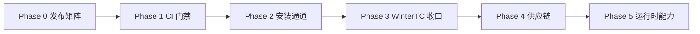

# Beejs 基础设施与能力待办清单

> 目标：把 Beejs 从「项目 CI + 能发 GitHub Release」补成一套语言运行时该有的配套设施，并把还裸着的运行时能力收口。  
> 事实来源：当前默认构建、`.github/workflows/`、`install.sh`、`Cargo.toml`、`src/main.rs`、`docs/GITHUB_ACTIONS_RUNTIME_INFRASTRUCTURE.md`。不引用历史 `STAGE_*` 报告。  
> 状态：必须卡（1–12）已在本仓库落地。线上 `v*` Release / GHCR / Homebrew 安装仍需推 tag 与 secret，本地不可验证。

## 已经有了、不要重做

| 能力 | 现状 |
|---|---|
| PR 门禁 | `ci.yml`：`fmt`、clippy `-D warnings`、`cargo test`、Node conformance、`bee test examples/testing` |
| `v*` GitHub Release | `release-assets.yml`：非 draft，notes + SHA-256，linux x86_64 / macOS arm64 / macOS Intel（`macos-15-intel`） |
| 安装脚本 | `install.sh` 从 GitHub Release 拉 `bee-${VERSION}-${TARGET}.tar.gz`（仅 macOS + Linux x86_64） |
| WinterTC 第一批 | `DOMException`、`navigator`、`URLPattern`、queuing strategies、`ReadableStream.from`、`bee:sockets` TCP、`wintercg`/`wintertc` exports、`import.meta.main/env/resolve`；`tests/wintertc_compliance_tests.rs` |
| 工具链入口 | `bee fmt` / `lint` / `bench` / `compile` / `types` / `task` / `lsp` / `run --inspect` 已有命令表面 |

评估结论（详见 [GITHUB_ACTIONS_RUNTIME_INFRASTRUCTURE.md](./GITHUB_ACTIONS_RUNTIME_INFRASTRUCTURE.md)）：**尚未达到完整的「语言运行时配套设施」水准。** 下面就是把缺口一次做完的清单。

---

## 战役怎么切

建议按 Phase 顺序做。同一 Phase 内可以并行，跨 Phase 有依赖（例如没有 Windows 产物就不要先写 winget）。

---

## Phase 0 — 发布矩阵补全（P0）

没有这几项，`install.sh`、Docker、Windows 用户都装不全。

### 0.1 Windows 预编译产物

- **缺口**：Release 没有 `x86_64-pc-windows-msvc`，也没有 `.zip`。`install.sh` 直接 `unsupported OS`。
- **要做**：
  - `release-assets.yml` 增加 `windows-latest` + `x86_64-pc-windows-msvc`。
  - 产物命名 `bee-${TAG}-x86_64-pc-windows-msvc.zip`（内含 `bee.exe`）。
  - `scripts/generate_release_notes.py` 的平台探测补 Windows。
  - `tests/release_workflow_tests.rs` 断言 Windows 矩阵存在、禁止再出现已退役 runner。
- **验收**：tag 工作流 YAML 含 Windows job；本地 `cargo build --release` 在 Windows 或 cross 能产出 `bee.exe`。

### 0.2 Linux aarch64 预编译产物

- **缺口**：`install.sh` 对 Linux arm64 明确失败：`prebuilt Linux arm64 archive is not available yet`。
- **要做**：
  - `release-assets.yml` 增加 `ubuntu-24.04-arm`（或等价 ARM runner）+ `aarch64-unknown-linux-gnu`。
  - `install.sh` 的 `resolve_platform` 允许 `aarch64-unknown-linux-gnu`。
- **验收**：`install.sh` 在 Linux aarch64 能拼出正确 asset URL；workflow 测试覆盖该 target。

### 0.3 Release notes 源文件对齐

- **缺口**：`generate_release_notes.py` 只找 `docs/releases/<tag>.md`，仓库实际写的是 `docs/RELEASE_NOTES_v1.8.0.md`。v1.8.0 dry-run 会落到 git log，正式发布说明丢失。
- **要做**：候选路径增加 `docs/RELEASE_NOTES_${tag}.md`、`docs/RELEASE_NOTES_v${version}.md`；可选把新版本统一写进 `docs/releases/`。
- **验收**：`python3 scripts/generate_release_notes.py --tag v1.8.0 --release-dir <dir>` 正文来自 v1.8.0 正式说明，而不是空 git changelog。

### 0.4 默认 crates.io 发布可见性

- **缺口**：`CARGO_REGISTRY_TOKEN` 为空时 crates.io 步骤被跳过，Release 看起来成功、crate 却没上。
- **要做**：token 缺失时打明确 warning/annotation；在发布文档里写「未配置则跳过」；`Cargo.toml` `include` 与 `cargo package --locked` 继续作为 CI 门禁。
- **验收**：workflow 在无 secret 时日志可见跳过原因；有 secret 时 `cargo publish --locked` 仍挂在 `v*` Release job。

---

## Phase 1 — CI 达到语言运行时门禁（P0）

### 1.1 Feature 矩阵失败即红

- **缺口**：`ci.yml` 对 `ai` / `benchmarks` / `observability` 编译失败只 `::warning::`。
- **要做**：`cargo check --features $feat` 失败则 job 失败。先修到三个 feature 都能编过，再改 YAML。
- **验收**：故意破坏任一 feature 时 CI 变红；当前三个 feature `cargo check --features` 退出码 0。

### 1.2 Windows CI 冒烟

- **缺口**：`checks` 只 Ubuntu；`release-build` 只有 ubuntu + macos。
- **要做**：`ci.yml` 增加 `windows-latest`：`cargo build --release` + `bee --version` + `bee eval "1+1"`。
- **验收**：PR 上出现 Windows 检查；失败阻断合并。

### 1.3 macOS 不只做 release smoke

- **缺口**：macOS 只跑 release 二进制 `--version` / `eval`，不跑 clippy/test。
- **要做**：`macos-latest` 至少 `cargo test --lib --tests`（可缩小到与 V8 相关的 integration，避免磁盘打满）。
- **验收**：PR 上 macOS 测试 job 为 required。

### 1.4 点名 WinterTC 合规测试

- **缺口**：WinterTC 只混在 `cargo test` 里，失败时不好定位。
- **要做**：CI 增加一步 `cargo test --test wintertc_compliance_tests -- --test-threads=1`。
- **验收**：该步独立出现在 `ci.yml` checks。

### 1.5 Dependabot + cargo-audit

- **缺口**：`.github/` 无 Dependabot；无定期 `cargo audit` / `cargo deny`。
- **要做**：
  - `.github/dependabot.yml`：`cargo` 与 `github-actions` 每周。
  - CI 或独立 workflow 跑 `cargo audit`（或 `cargo deny advisories`），高危漏洞失败。
- **验收**：打开 Dependabot PR 通道；audit job 存在。

---

## Phase 2 — 安装与分发通道（P0/P1）

### 2.1 GHCR 发布容器

- **缺口**：`docker.yml` 仅 `workflow_dispatch`，`load: true`，tag `beejs:ci`，不登录、不 push。
- **要做**：
  - `v*` tag 与 `main` 构建并推 `ghcr.io/zh30/beejs:${tag}` 与 `:latest`。
  - 多架构至少 `linux/amd64`；有 0.2 后再加 `linux/arm64`。
  - 保留 `--version` smoke。
- **验收**：推 tag 后 GHCR 出现带 checksum 的 image；`docker.yml` 不再是唯一、且仅手动的路径。

### 2.2 `install.sh` 覆盖新平台

- **缺口**：脚本不认 Windows、Linux arm64。
- **要做**：随 0.1 / 0.2 产物更新 `resolve_platform`；Windows 提供 `install.ps1`。
- **验收**：文档中的 `curl | sh` 对 linux-gnu x64/arm64、darwin x64/arm64 都能解析到真实 Release asset 名。

### 2.3 包管理器配方（至少一条自动通道）

- **缺口**：无 Homebrew / Scoop / winget。语言运行时通常至少有一条 OS 包管理器。
- **要做**（三选一做完，另外两条可开 issue）：
  1. Homebrew tap：`brew install zh30/tap/bee` 指向 GitHub Release。
  2. `winget` manifest 跟 Windows zip。
  3. Scoop bucket。
- **验收**：README 安装区有一条非 `curl | sh` 的官方安装命令，且指向当前 `v*` 产物。

---

## Phase 3 — WinterTC 收口（P1）

第一批 API 已进默认运行时。下面是规划里做过、但还没达到可对外承诺的部分。

### 3.1 Sockets TLS 是真的

- **缺口**：`start_tls_socket` 目前是空实现；`secureTransport: "on"` 不会真正握手。
- **要做**：`src/sockets/mod.rs` 用 rustls 做 client TLS；`startTls()` 升级已有 TCP；测试用本机 listener + 自签证书或 `rustls` 测试服务器。
- **验收**：`tests/wintertc_compliance_tests.rs`（或新 `wintertc_sockets_tls_tests.rs`）对 `secureTransport: "on"` 走真实 TLS，失败时是证书/协议错误而不是 silently upgraded。

### 3.2 `import.meta.resolve` 走真实解析器

- **缺口**：`runtime_minimal.rs` 里 `import.meta.resolve` 对非相对路径直接拼 `/node_modules/...`。
- **要做**：接到 `resolve_esm_module`，返回 `file://` URL；覆盖 `wintercg` 条件导出。
- **验收**：合规测试里 `import.meta.resolve('winter-lib')` 解析到 `winter.js`，而不是假路径。

### 3.3 `unhandledrejection` 真正派发

- **缺口**：`PromiseRejectionEvent` 构造器有了，V8 Promise reject tracker 未联动 `onunhandledrejection`。
- **要做**：isolate Promise 钩子 + `reportError` 一致；测试 `queueMicrotask` 后 handler 被调用。
- **验收**：`tests/wintertc_compliance_tests.rs` 覆盖 handler 收到 `PromiseRejectionEvent`。

### 3.4 官网 WinterTC 文档

- **缺口**：`website/` 无 wintertc 词条。
- **要做**：`website/src/docs/wintertc-compliance.md` + `.zh.md`，locales 导航，API 手册挂 `DOMException` / `URLPattern` / `bee:sockets`。
- **验收**：`cd website && npm run build` 通过；侧栏能点到。

---

## Phase 4 — 供应链与发布工程（P1）

### 4.1 发布物签名

- **缺口**：Release 只有 SHA-256 文本，无 Sigstore/cosign。
- **要做**：`release-assets.yml` 对每个 `bee-*.tar.gz` / `.zip` cosign sign-blob；`checksums.txt` 旁放 `.sig`。
- **验收**：Release 资产含签名；文档有 `cosign verify-blob` 示例。

### 4.2 SBOM

- **缺口**：无 CycloneDX / SPDX。
- **要做**：发布 job 生成 `bee-${TAG}.cdx.json` 并挂到 Release。
- **验收**：Release 附件含 SBOM。

### 4.3 CodeQL

- **缺口**：无 code scanning。
- **要做**：`.github/workflows/codeql.yml`，语言 `javascript-typescript` 不够，主语言是 Rust（若 GitHub CodeQL Rust 可用则打开，否则 `cargo-geiger`/`cargo deny` 补位）。
- **验收**：`main` 与 PR 有扫描结果，不要求零告警，但 workflow 必须跑完。

---

## Phase 5 — 运行时与 DX 能力（P1/P2）

这些是「语言运行时」用户会拿来对比 Node/Deno/Bun 的缺口。可以和 Phase 0–2 并行，但不要插在发布矩阵之前。

### 5.1 Inspector 接到真正的 V8 Inspector

- **缺口**：`src/tooling/inspector.rs` 是自建 CDP HTTP/WS，不是 `v8::inspector::V8Inspector`。Chrome 能连上 ≠ 能下断点看 scope。
- **要做**：rusty_v8 0.22 能接多少接多少；至少 `Debugger.paused` / `Runtime.evaluate` 打到 isolate。`--inspect-brk` 在用户脚本第一句停住。
- **验收**：集成测试覆盖 `/json/version` 与 pause/resume；文档给出 VS Code `attach` 配置。

### 5.2 `bee serve` HTTPS 与 fetch handler

- **缺口**：HTTPS 分支打印提示后 `return Ok(())`，不监听。
- **要做**：要么实现 rustls terminator，要么 CLI 对 `--https` 以错误码退出并指向外部 terminator；HTTP 路径保持跑用户 `fetch` handler。
- **验收**：`bee serve --https` 不再假装成功。

### 5.3 VS Code 扩展对齐当前二进制

- **缺口**：`tools/vscode-extension/README.md` 仍写 `beejs-team` 与 `v0.1.0` linux-x64 包名。
- **要做**：调试配置走 `bee run --inspect-brk`；README 资产名与 `release-assets.yml` 一致；能本地 `vsce package`。
- **验收**：扩展 README 的下载 URL 能在当前 Release 命名规则下拼出来。

### 5.4 N-API 加载器（明确范围）

- **缺口**：CURRENT_SCOPE 写明 N-API 仅调研，无 loader。
- **要做**：先做 `process.dlopen` / 最小 napi 能加载纯 C hello addon，不承诺 Prisma/sharp。
- **验收**：`tests/` 里有编译好的 `.node` fixture + `dlopen` 调用成功。做不到就保持 Experimental，不要在 README 暗示支持。

### 5.5 文档事实源同步

- **缺口**：`docs/CURRENT_SCOPE.md` 仍写 package version `1.0.0`，Cargo 已是 `1.8.0`；`CHANGELOG.md` 未跟到 v1.8.0。
- **验收**：CURRENT_SCOPE、CHANGELOG、`docs/RELEASE_NOTES_v1.8.0.md`、`Cargo.toml` 版本一致。

---

## 建议的「一起做完」顺序（可当 sprint board）

把上面折叠成 12 张必须做完的卡。其余标为可选。

| # | 卡 | Phase | 必须？ | 状态 |
|---|---|---|---|---|
| 1 | Windows zip + CI smoke | 0.1 + 1.2 | 必须 | 已落地 |
| 2 | Linux aarch64 tarball + `install.sh` | 0.2 + 2.2 | 必须 | 已落地 |
| 3 | Release notes 路径修复 | 0.3 | 必须 | 已落地 |
| 4 | Feature 矩阵失败即红 | 1.1 | 必须 | 已落地 |
| 5 | CI 点名 WinterTC + macOS tests | 1.3 + 1.4 | 必须 | 已落地 |
| 6 | Dependabot + cargo-audit | 1.5 | 必须 | 已落地 |
| 7 | GHCR 在 `v*` 推镜像 | 2.1 | 必须 | workflow 已落地；live push 待 tag |
| 8 | Homebrew 或 winget 一条通道 | 2.3 | 必须 | `Formula/bee.rb` 已落地 |
| 9 | Sockets TLS + `import.meta.resolve` + unhandledrejection | 3.1–3.3 | 必须 | 已落地 |
| 10 | 官网 WinterTC 文档 | 3.4 | 必须 | 已落地 |
| 11 | cosign + SBOM | 4.1–4.2 | 必须 | workflow 已落地；live 待 tag |
| 12 | CURRENT_SCOPE / CHANGELOG 对齐 1.8.0 | 5.5 | 必须 | 已落地 |
| 13 | Inspector 真 V8 / serve HTTPS / VS Code 扩展 / N-API | 5.1–5.4 | 可第二波 | 未做 |
| 14 | CodeQL | 4.3 | 可第二波 | 未做 |

---

## 明确不做（本清单范围外）

- 重开 `src/lib.rs` 里注释掉的历史模块。
- 完整 WPT / 完整 Node 测试套。
- 把 `feature = "ai"` 宣传成产品级 LLM。
- 为了演示而打一个生产 `v*` tag（等上述发布矩阵落地后再打）。

---

## 完成后怎么算「语言运行时配套设施」

同时满足：

1. `v*` 发布 linux gnu x64/arm64、macOS arm64/x64、Windows x64，带 checksum 与签名。  
2. `install.sh` / 一条 OS 包管理器能装到上述产物。  
3. PR 在 Linux + macOS + Windows 冒烟，feature 矩阵失败即红，WinterTC 测试单独一步。  
4. GHCR 有对应 tag 的镜像。  
5. 文档版本号与 `Cargo.toml` 一致，WinterTC 在官网上看得到。
