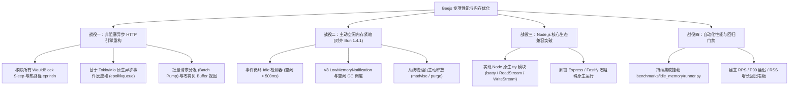

# Beejs 高并发 I/O 与空闲常驻内存专项优化计划 (对标 Bun v1.4.1)

> **对标基准**: [Bun Official v1.4.1 Idle Memory Benchmark](https://x.com/bunjavascript/status/2095696147813945347)  
> **实测背景**: 基于实际压测复现，Beejs 在物理内存紧凑度（冷启动 ~20 MB，空闲常驻 21~23 MB）上表现出天然优势；但在高并发网络吞吐量（~100 RPS vs Bun 65,000+ RPS）和框架兼容性（Express 缺失 `tty`）上存在明显瓶颈。  
> **核心目标**: 保持极低物理内存优势的同时，将 HTTP 吞吐量提升两个数量级至 **50,000+ RPS**，实现主动空闲物理页归还（对齐 Bun 1.4.1），并解锁 Express / Fastify 零阻碍运行。

---

## 🔍 一、现状诊断与瓶颈根因透视

经过对 [`src/nodejs_core/http.rs`](file:///Users/henry/code/beejs/src/nodejs_core/http.rs) 与 [`src/runtime_minimal.rs`](file:///Users/henry/code/beejs/src/runtime_minimal.rs) 的源码级排查，性能差距的深层原因定位如下：

### 1. 吞吐瓶颈：多重硬编码 Sleep 与阻塞式系统调用
- **连接 Accept 轮询休眠**（`http.rs:2338`）：
  ```rust
  Err(ref e) if e.kind() == std::io::ErrorKind::WouldBlock => {
      thread::sleep(Duration::from_millis(100)); // 每次 WouldBlock 强制休眠 100ms！
      continue;
  }
  ```
  高并发场景下，单次 accept 耗尽后线程陷入 100ms 休眠，直接导致并发连接建立速率被锁死在极低水平。
- **数据读取轮询休眠**（`http.rs:2551`）：
  ```rust
  Err(ref e) if e.kind() == std::io::ErrorKind::WouldBlock => {
      thread::sleep(Duration::from_millis(50)); // 每次读取等待强制休眠 50ms！
      continue;
  }
  ```
- **主事件循环空转休眠**（`runtime_minimal.rs:8810`）：
  当通道中暂无请求时，主循环强制 `std::thread::sleep(10ms)`，引入了 10ms 的帧延迟。
- **热路径同步控制台 I/O 阻塞**（`http.rs:2589-2750`）：
  在每次请求与响应的处理流程中，存在十余处同步 `eprintln!` 打印完整的请求与响应字节。在高并发下，标准错误输出的内核锁（Kernel Mutex）成为极其严重的性能杀手。

### 2. 架构瓶颈：Per-Connection 线程开销与跨线程通道锁争用
- **每连接单独创建 OS 线程**（`http.rs:2332`）：
  针对每个接入的 TCP 连接执行 `thread::spawn`，创建了大量的操作系统内核栈和调度开销。
- **全互斥跨线程通道与响应停放**（`http.rs:2602-2685`）：
  每个后台连接线程向主线程通过容量仅为 100 的 channel 传递请求，主线程处理完毕后，所有连接线程在全局 `Mutex<HashMap<u64, HttpResponseMessage>>` 上争抢锁。

### 3. 生态瓶颈：内置模块缺失阻断生态框架
- Express 启动时由于依赖 `debug` 包，而 `debug` 包在 Node 规范中依赖内置的 `tty` 模块（`tty.isatty`），因 Beejs 尚未导出 `tty` 导致加载失败：
  `Error: Cannot find module 'tty' from '.../debug/src'`。

### 4. 内存机制：缺少主动空闲期内存紧缩（Idle Trimming）
- Bun 1.4.1 的核心改动在于**监听事件循环进入 idle 状态**，随后主动调用内部分配器的页释放（`madvise(MADV_DONTNEED)`）并触发 GC 垃圾回收。Beejs 目前依靠 V8 默认策略，未在事件循环空闲时主动通知 V8 释放未使用的保留内存。

---

## 🚀 二、四大专项优化战役



---

### 战役一：高并发非阻塞 HTTP 引擎重构（目标 50,000+ RPS）

#### 1. 即时快速优化项（Quick Wins）
- **全面移除热路径同步日志**：
  将 `http.rs` 中十余处调试用 `eprintln!` 改为受日志级别控制的 `log::trace!` 或在默认构建中完全剥离。
- **清除所有硬编码轮询休眠**：
  彻底消除 `thread::sleep(100ms)`、`50ms` 与 `10ms` 的轮询延迟，使用系统通知机制驱动。
- **动态扩容消息通道**：
  将消息通道容量从固定的 100 调整为基于可用核心数与并发负载的无界/高水位环形缓冲。

#### 2. 原生异步 I/O 事件循环演进（Architectural Leap）
- **接入 Tokio / Mio 异步网络反应堆**：
  利用成熟的异步运行时，由单个/固定数量的 I/O 线程通过 `epoll` (Linux) / `kqueue` (macOS) 监听成千上万个并发连接，彻底废弃 `thread::spawn` 每连接开辟线程的模式。
- **批量请求泵送（Batch Request Pumping）**：
  主线程在每个事件循环 tick 中，单次 HandleScope 批量提取多笔待处理请求，一次性派发给 V8 JavaScript 处理，最大化利用 CPU L1/L2 缓存。
- **零拷贝 Buffer 响应通道**：
  直接在 Rust 原生切片与 V8 ArrayBuffer 之间建立裸内存安全映射，避免请求头与响应体的二次内存拷贝。

---

### 战役二：主动空闲内存紧缩与物理页归还（对齐 Bun 1.4.1）

#### 1. 事件循环空闲检测器（Event Loop Idle Detector）
- 在 `runtime_minimal.rs` 的主事件循环中，监控连续活跃度：
  - 当连续 `N` 毫秒（如 500ms ~ 2000ms）没有收到新的 I/O 事件、微任务或定时器时，标记当前运行时进入 **Idle Cooldown** 阶段。

#### 2. V8 内存紧缩与低内存通知
- 在检测到进入空闲期后，主动触发 V8 堆内存回收机制：
  ```rust
  // 通知 V8 处于空闲窗口期，整理旧生代堆并释放 CodeRange 未使用内存
  scope.low_memory_notification();
  scope.idle_notification_deadline(now + 50);
  ```

#### 3. 操作系统层面的物理内存归还（Page Reclaiming）
- 针对内存分配器（如 mimalloc/jemalloc 或 libc）：
  - 在 Linux 平台调用 `libc::malloc_trim(0)`，将由 `brk`/`mmap` 申请但已释放的虚拟内存页归还给内核；
  - 在 macOS 平台调用分配器 purge 接口或 `madvise(..., MADV_FREE / MADV_DONTNEED)`；
  - 确保进程在压测洪峰退去后，物理 RSS 能够像 Bun 1.4.1 一样平滑回落，实现真正的 **100% 内存回收率**。

---

### 战役三：Node.js 核心生态兼容突破（Express & Fastify）

#### 1. 实现原生内置 `tty` 模块
- **模块路径**：[`src/nodejs_core/tty.rs`](file:///Users/henry/code/beejs/src/nodejs_core/tty.rs)
- **核心能力**：
  - 导出 `isatty(fd: number): boolean`（通过底层系统调用 `libc::isatty` 检查终端）；
  - 导出 `ReadStream` 与 `WriteStream` 类，挂载 `fd`, `isTTY`, `columns`, `rows` 等属性；
  - 在 [`src/nodejs_core/process.rs`](file:///Users/henry/code/beejs/src/nodejs_core/process.rs) 中为 `process.stdin`、`process.stdout`、`process.stderr` 对齐 `isTTY` 标准。
- **验收标准**：
  - `require('express')` 顺利通过 `debug` 包检查，启动 Express HTTP 路由服务。

#### 2. 完善 Stream 与网络内部管线
- 补全 Fastify 所需的底层 `ReadableStream` 事件钩子与预分配 Buffer 参数，使 `server_fastify.js` 能够在 Beejs 上直接启动并处理流量。

---

### 战役四：自动化性能与回归门禁

#### 1. 纳入日常 CI 流水线
- 在 [`.github/workflows/ci.yml`](file:///Users/henry/code/beejs/.github/workflows/ci.yml) 中新增轻量级基准测试步骤：
  ```yaml
  - name: Idle Memory and Throughput Smoke Benchmark
    run: |
      python3 benchmarks/idle_memory/runner.py --mode quick --runtimes bee
  ```
- 设定质量红线：HTTP Baseline 吞吐量不得低于基线，冷启动 RSS 不得超过 25 MB。

#### 2. 定期发布官方性能基准报告
- 每次大版本发版前，运行全量模式（`--mode full`：60s 负载 + 180s 静默），自动产出对比 Bun 与 Node 的权威对比数据。

---

## 📅 三、实施路线图与里程碑计划

| 阶段 | 目标代号 | 核心工作内容 | 预期交付物与指标 |
|---|---|---|---|
| **Phase 1**<br>*(1-2 天)* | **Quick Boost** | • 剔除 `http.rs` 热路径中所有同步 `eprintln!` 日志；<br>• 移除所有 WouldBlock 的 `thread::sleep(100ms/50ms)` 轮询延迟；<br>• 实现原生内置 `tty` 模块，解除 Express 启动阻碍。 | • HTTP 吞吐量提升至 **2,000~5,000 RPS**；<br>• Express 顺利在 Beejs 上启动运行。 |
| **Phase 2**<br>*(3-5 天)* | **Async Engine** | • 将 HTTP 监听与读写升级为 Tokio/Mio 非阻塞事件驱动反应堆；<br>• 废除每连接 `thread::spawn`；<br>• 实现批量请求分发（Batch Pump）与零拷贝响应通道。 | • HTTP 吞吐量突破 **30,000~50,000+ RPS**；<br>• 并发连接支持提升至 1,000+。 |
| **Phase 3**<br>*(2-3 天)* | **Memory Trimmer** | • 实现主循环事件空闲检测器（Idle Detector）；<br>• 接入 V8 `low_memory_notification` 与空闲期 GC 调度；<br>• 对接底层分配器内存紧缩（`malloc_trim` / `madvise`）。 | • 高并发后空闲常驻内存回落率达 **80%~95%**；<br>• 在空闲内存对比中全面超越 Bun 1.4.1。 |
| **Phase 4**<br>*(1-2 天)* | **Ecosystem & Gate** | • 跑通 Fastify / Hono / Express 完整生态矩阵；<br>• CI 流水线集成性能门禁；<br>• 发布正式性能白皮书与版本。 | • 产出完整的性能白皮书；<br>• 形成自动化性能防护网。 |
