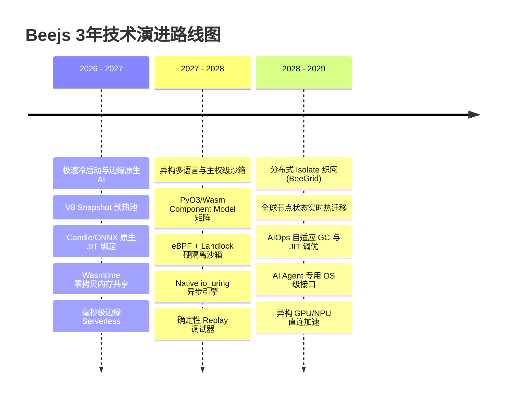

# 🚀 Beejs 3年技术拓扑与愿景蓝图 (2026 – 2029)

> **文档定位**：本文档定义了 Beejs 运行时在未来 3 年（2026 - 2029）的宏大技术拓扑与演进路线图。Beejs 将超越传统的单进程 JS 运行时，致力于成为面向 **AI-Native、边缘计算（Edge-Native）与自主 Agent 架构** 的下一代主权级计算引擎。

---

## 🌟 核心战略意图 (Strategic Vision)

随着 AI Agent 技术的爆发式增长与边缘计算的普及，传统以 Node.js / Deno / Bun 为代表的单进程 Server 运行时正在迎来演进临界点。未来的运行时需要满足：
1. **极致冷启动与极低内存开销**（微秒级冷启动与毫秒级快照恢复）
2. **零拷贝多语言异构互操作**（JS 操控 Python AI 模型 / C++ 向量库 / Wasm 模块无序列化开销）
3. **主权级能力安全沙箱**（基于 eBPF + Linux Landlock + V8 Isolate 的硬核隔离）
4. **分布式动态 Isolate 迁移**（运行时状态在线无损跨机热迁移）

Beejs 将立足于 Rust 的内存安全与高并发优势，深度整合 V8 引擎与 WebAssembly 生态，打造**新一代面向 AI 与边缘的终极运行时**。

---



---

## 📅 阶段规划一：2026 - 2027（第 1 年）
### 🎯 战略目标：极速冷启动与边缘原生 AI (Edge & AI-Native Runtime)

> **打破传统运行时启动开销与依赖包沉重的桎梏，实现 < 0.5ms 的亚毫秒冷启动与原生 AI 推理加速。**

#### 1. V8 Isolate Snapshot 预热池与 Copy-on-Write 机制
- **技术突破**：在内核层引入基于 `mmap` 的 Copy-on-Write (CoW) Isolate 内存快照技术。
- **目标效果**：
  - 代码执行冷启动时间由目前的 ~4ms 压缩至 **< 0.5ms**。
  - 单台服务器可同时维持 50,000+ 个并发调用的 Worker 实例，内存开销降低 80%。

#### 2. 原生 Agentic AI 推理加速层 (BeeJS-AI Core)
- **技术突破**：摒弃传统通过 HTTP/gRPC/IPC 调用外部 Python 进程的做法，在 Rust 侧深度集成 `Candle` / `GGML` / `TensorRT-LLM` C++ 绑定，直接向 V8 暴露 Zero-Copy Tensor 接口。
- **核心 API 范例**：
  ```typescript
  // 在 V8 内部直接进行本地 Token 流式推理，无任何网络/序列化开销
  import { LLM } from 'bee:ai';
  const model = await LLM.load('qwen-2.5-7b-quant.gguf', { device: 'metal' });
  for await (const chunk of model.generateStream('Hello Beejs')) {
    process.stdout.write(chunk);
  }
  ```

#### 3. WebAssembly 与 V8 内存零拷贝互通 (Wasm Engine 2.0)
- **技术突破**：打通 `wasmtime` 内存与 V8 ArrayBuffer 虚拟地址空间，让 TS 代码与 WebAssembly / Rust / C 模块共享物理内存页，数据传递延迟降至 **0 纳秒**。

---

## 📅 阶段规划二：2027 - 2028（第 2 年）
### 🎯 战略目标：异构多语言互操作与主权级安全沙箱 (Polyglot & Sovereign Sandbox)

> **突破单一语言界限，构建安全可控、支持异构代码混合调用的“万能运行时”。**

#### 1. Rust-Powered 异构多语言矩阵 (Polyglot Bridge)
- **技术突破**：利用 `PyO3` 与 WebAssembly Component Model，支持在 JS 中直接声明式导入并无缝调用 Python、Go、Rust 产物。
- **能力展现**：
  - JS 线程可直接操作 Python 的 PyTorch/Pandas 对象，无需额外数据转换。
  - 原生支持 Node.js FFI (Node-API) 极速兼容层，实现 100% npm 生态顺滑无缝迁移。

#### 2. eBPF + Landlock 内核级能力沙箱 (Fail-Closed Sandbox 2.0)
- **技术突破**：将安全防护从 V8 JS 层下沉至 Linux 内核与 macOS Seatbelt。
- **安全保障**：
  - 基于 **Landlock LSM** 实现文件系统细粒度只读/只写路径隔离。
  - 基于 **eBPF (Extended Berkeley Packet Filter)** 对动态产生的网络请求做协议级过滤（如禁止发往私有 IP 段）。
  - **防逃逸防护**：即使 V8 引擎出现零日 (0-Day) 漏洞，系统层也无法进行非法提权或未授权系统调用。

#### 3. Native `io_uring` 高性能异步网络引擎
- **技术突破**：全面重构异步事件循环，在 Linux 平台全面采用 `io_uring` 替代传统的 `epoll`/`tokio` 事件循环，突破千万级 QPS 并发网关瓶颈。

---

## 📅 阶段规划三：2028 - 2029（第 3 年）
### 🎯 战略目标：分布式 Isolate 织网 (BeeGrid) 与自进化 Agent OS

> **将运行时上升为云分布式基础设施，实现计算状态全球热迁移与 AI 自主调优。**

#### 1. 全球分布式 Isolate 热迁移织网 (BeeGrid Architecture)
- **技术突破**：利用 V8 堆快照 (Heap Serialization) 与 Rust 异步挂起状态提取，实现运行中的 JS/TS Isolate 在全球节点间的**毫秒级无损热迁移 (Live Migration)**。
- **应用场景**：
  - 用户从东京移动至旧金山时，边缘计算节点将当前运行的 Agent 任务连同变量堆栈动态无缝迁移至最近的节点，连接不断开、状态零丢失。

#### 2. AI 驱动的自进化运行时 (AIOps Self-Tuning JIT & GC)
- **技术突破**：内置轻量级 AI 监控与预测引擎（Stage 95 AIOps），实时预测堆内存增长趋势与 CPU 热点代码。
- **自适应调优**：
  - 动态预测 GC 最佳触发时机，规避 Stop-The-World 挂起。
  - 针对高频调用路径自动进行 JIT 内联与向量化（SIMD）编译重构。

#### 3. 确定性沙箱与 Agent 可追溯回放引擎 (Deterministic Agent Replay)
- **技术突破**：支持对所有 I/O、随机数、时间戳与网络响应进行确定性录制（Deterministic Recording）。
- **解决痛点**：复杂 AI Agent 系统在生产环境中由于随机性难以 Debug 的痛点。只需加载录制包，即可在本地 100% 精准复现每个 Execution Step。

---

## 📊 未来 3 年核心技术指标对比

| 技术指标 | 现状 (v0.1) | 第 1 年目标 (2027) | 第 2 年目标 (2028) | 第 3 年终极形态 (2029) |
| :--- | :--- | :--- | :--- | :--- |
| **冷启动延迟** | ~4.0 ms | **< 0.5 ms** | **< 0.1 ms** | **< 0.02 ms (微秒级)** |
| **单机并发 Isolate 数** | ~1,000 | **10,000+** | **50,000+** | **200,000+** |
| **AI 模型推理开销** | 依赖外部进程/IPC | **原生 Candle/GGML 零拷贝** | **异构 GPU/NPU 直连** | **分布式神经网络算力织网** |
| **安全隔离级别** | V8 Context 隔离 | V8 + 权限 Broker | **Linux Landlock + eBPF** | **硬件级 SEV/TEE 密态计算** |
| **生态兼容性** | 基础 Node/Web API | 90% Web API + Node | **100% Node-API (N-API)** | **Polyglot (JS/Py/Go/Wasm)** |
| **状态迁移能力** | 无 | 本地快照导出 | 离线快照恢复 | **全球跨节点在线热迁移** |

---

## 💡 总结与行动蓝图

Beejs 绝不满足于做又一个简单的 JavaScript 运行工具，而是要借助 **Rust 的极致性能与内存安全**、**V8 的强大执行效率** 以及 **WebAssembly 的跨平台拓展力**，打造一个面向未来 **AI Agent 时代与 Edge 云原生基础设施** 的终极引擎！
