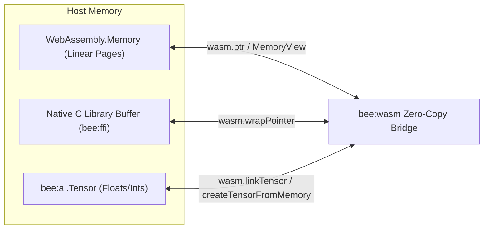

## 1. Overview & Motivation

WebAssembly execution in modern runtimes often suffers from the **boundary serialization tax**: passing data (e.g. AI embeddings, images, network buffers, or native FFI results) between JavaScript, native host memory, and WebAssembly linear memory typically requires multiple copying steps.

For AI agents and high-throughput microservices, buffer copies degrade latency and inflate memory footprint.

**Beejs v1.5.0 introduces `bee:wasm`**, a WebAssembly 2.0 zero-copy shared memory subsystem that directly bridges:
- **`WebAssembly.Memory`** linear memory pages
- **V8 `ArrayBuffer` & `TypedArray`** backing stores
- **Native C ABI host pointers** (`bee:ffi`)
- **High-performance AI Tensors** (`bee:ai.Tensor`)

---

## 2. Key Architecture: Physical Shared Memory

Rather than copying arrays back and forth across isolate boundaries, `bee:wasm` exposes physical 64-bit host virtual addresses and provides zero-overhead pointer mapping:



---

## 3. Core API Reference

### 3.1 Pointer Extraction: `wasm.ptr(target)`

Retrieves the 64-bit physical virtual memory address of any `WebAssembly.Memory`, `ArrayBuffer`, `TypedArray`, or `bee:ai.Tensor`.

```typescript
import wasm from 'bee:wasm';

const mem = new WebAssembly.Memory({ initial: 2 });
const rawAddress: bigint = wasm.ptr(mem);

console.log('Wasm linear memory base pointer:', rawAddress);
```

### 3.2 Direct Memory Operations: `copyMemory`, `fillMemory`, `compareMemory`

Ultra-fast native `libc` memory primitives operating directly on 64-bit pointers without JavaScript overhead:

```typescript
import wasm from 'bee:wasm';

const srcPtr = wasm.ptr(sourceArrayBuffer);
const dstPtr = wasm.ptr(wasmMemory);

// High-performance memmove
wasm.copyMemory(srcPtr, dstPtr, 1024);

// High-performance memset
wasm.fillMemory(dstPtr, 0, 1024);

// High-performance memcmp
const diff = wasm.compareMemory(srcPtr, dstPtr, 1024);
```

### 3.3 Zero-Copy Tensor Interop: `createTensorFromMemory`

Construct a `bee:ai.Tensor` directly mapped to WebAssembly linear memory with zero byte allocations:

```typescript
import wasm from 'bee:wasm';

const mem = new WebAssembly.Memory({ initial: 1 });

// Create a 2x2 float32 Tensor directly inside Wasm memory at offset 0
const tensor = wasm.createTensorFromMemory(mem, 0, [2, 2], 'float32');

// Mutating tensor data immediately mutates Wasm memory
tensor.data[0] = 42.5;

const u8View = new Uint8Array(mem.buffer);
console.log('First float byte in Wasm memory:', u8View[0]); // Zero copy confirmed!
```

### 3.4 Memory-Mapped Wasm Module Loading: `loadModuleMmap`

Bypass double-buffering and heap bloat when compiling large `.wasm` binaries:

```typescript
import wasm from 'bee:wasm';

// Loads .wasm via OS mmap and compiles into WebAssembly.Module
const module = await wasm.loadModuleMmap('./models/tokenizer.wasm');
const instance = await WebAssembly.instantiate(module);
```

### 3.5 Ergonomic `MemoryView`

Inspect and mutate structured data (u8, i32, f32, f64, C-strings, UTF-8 strings) inside linear memory:

```typescript
import { MemoryView } from 'bee:wasm';

const view = new MemoryView(mem);
view.setUint8(0, 255);
view.setInt32(4, 100000);
view.setFloat32(8, 3.14159);
view.setString(16, 'Beejs Wasm 2.0');

console.log(view.getString(16, 5)); // "Beejs"
```
