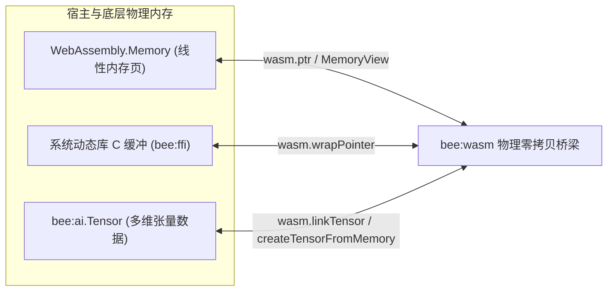

## 1. 架构背景与技术痛点

在现代 JavaScript/TypeScript 运行时中，WebAssembly 的执行通常伴随着**边界内存拷贝税（Serialization Tax）**：在宿主 JS、底层硬件驱动与 Wasm 线性内存之间交换数据（如 AI 向量嵌入、图像缓冲、网络报文等），往往需要多次堆分配与字节拷贝。

对于高吞吐边缘微服务和实时 AI Agent，频繁的内存拷贝会显著增加延迟并放大内存占用。

**Beejs v1.5.0 正式引入 `bee:wasm` 内建模块**，提供 WebAssembly 2.0 物理级零拷贝共享内存桥梁，将以下组件紧密互通：
- **`WebAssembly.Memory`** 线性内存页
- **V8 `ArrayBuffer` 与 `TypedArray`** 底层缓冲区
- **系统原生 C ABI 指针** (`bee:ffi`)
- **高性能 AI 多维张量** (`bee:ai.Tensor`)

---

## 2. 核心架构：物理共享内存互通

`bee:wasm` 直接暴露 64 位主机虚拟内存地址，并提供零开销指针映射能力：



---

## 3. 核心 API 参考

### 3.1 指针提取：`wasm.ptr(target)`

直接获取 `WebAssembly.Memory`、`ArrayBuffer`、`TypedArray` 或 `bee:ai.Tensor` 的 64 位物理虚拟内存地址（返回 `bigint`）。

```typescript
import wasm from 'bee:wasm';

const mem = new WebAssembly.Memory({ initial: 2 });
const rawAddress: bigint = wasm.ptr(mem);

console.log('Wasm 线性内存基地址:', rawAddress);
```

### 3.2 极速内存操作：`copyMemory`, `fillMemory`, `compareMemory`

基于底层操作系统 `libc` 实现的原生指令级内存块移动与比较，零 JS 循环损耗：

```typescript
import wasm from 'bee:wasm';

const srcPtr = wasm.ptr(sourceArrayBuffer);
const dstPtr = wasm.ptr(wasmMemory);

// 高性能 memmove 块移动
wasm.copyMemory(srcPtr, dstPtr, 1024);

// 高性能 memset 内存填充
wasm.fillMemory(dstPtr, 0, 1024);

// 高性能 memcmp 内存比较
const diff = wasm.compareMemory(srcPtr, dstPtr, 1024);
```

### 3.3 Tensor 零拷贝互通：`createTensorFromMemory`

直接基于 WebAssembly 线性内存创建 `bee:ai.Tensor`，完全免除内存分配与拷贝：

```typescript
import wasm from 'bee:wasm';

const mem = new WebAssembly.Memory({ initial: 1 });

// 在 Wasm 内存偏移量 0 处直接构造 2x2 float32 张量
const tensor = wasm.createTensorFromMemory(mem, 0, [2, 2], 'float32');

// 修改张量数据将物理反映在 Wasm 内存中
tensor.data[0] = 42.5;

const u8View = new Uint8Array(mem.buffer);
console.log('Wasm 内存对应字节已同步更新:', u8View[0]);
```

### 3.4 内存映射模块极速加载：`loadModuleMmap`

利用操作系统 `mmap` 直接将磁盘上的 `.wasm` 二进制文件映射入内存并编译，避免传统文件读取的双重缓冲开销：

```typescript
import wasm from 'bee:wasm';

// 使用 OS mmap 加载并编译 WebAssembly.Module
const module = await wasm.loadModuleMmap('./models/tokenizer.wasm');
const instance = await WebAssembly.instantiate(module);
```

### 3.5 结构化线性内存视图：`MemoryView`

在 Wasm 线性内存中读取和写入结构化基础数据类型与字符串：

```typescript
import { MemoryView } from 'bee:wasm';

const view = new MemoryView(mem);
view.setUint8(0, 255);
view.setInt32(4, 100000);
view.setFloat32(8, 3.14159);
view.setString(16, 'Beejs Wasm 2.0');

console.log(view.getString(16, 5)); // "Beejs"
```
